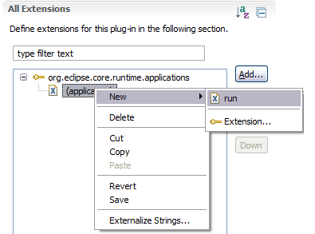
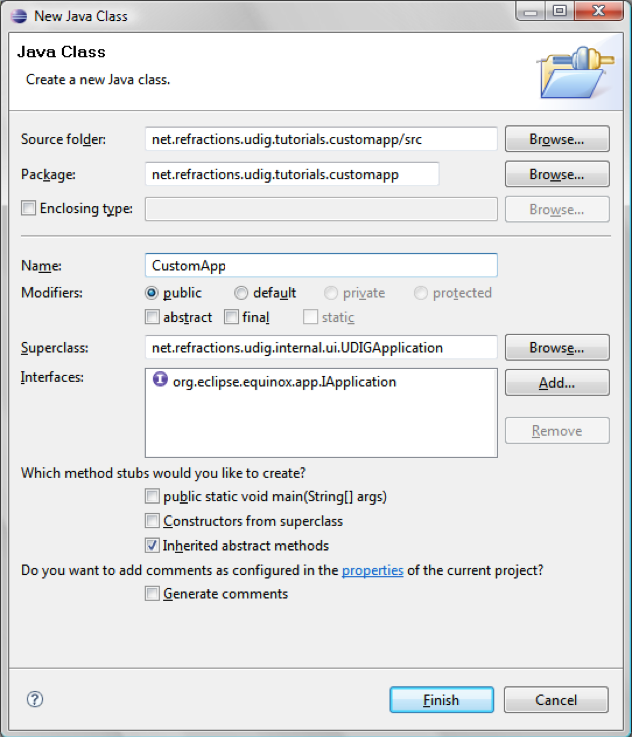
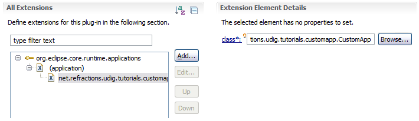
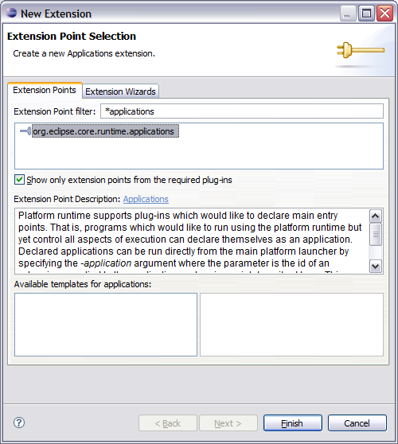
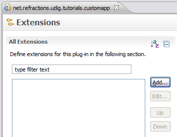

Application
===========

Everything in eclipse is handled through the plug-in extension mechanism, and defining an application is no different. The **org.eclipse.core.runtime** plug-in defines the concept of what it means to be an Application.

* Switch to the Extensions tab.

  |100002010000016500000114028B5D67_png|

* Press the :guilabel:`Add` button, and select the **org.eclipse.core.runtime.applications** extension point.

  |10000000000001F40000022EE67E309A_png|

* Press the :guilabel:`Finish` button.

* Right click on the (application) element and select :menuselection:`New --> Run`

  |100000000000018B000001253448E274_png|

* In the class text field enter: ``net.refractions.udig.tutorials.customapp.CustomApp``

  |10000000000002C6000000CE80B84FF1_png|

* Save your work, and then press the class link.

* Eclipse will open up a wizard for creating a New Java Class. Enter the following:

  Superclass: ``net.refractions.udig.internal.ui.UDIGApplication``

  |200000070000380500004138E9C60406_svm|

* Press the :guilabel:`Finish` Button

* In the newly created file add the following method:

  .. code-block:: java

     @Override

     protected WorkbenchAdvisor createWorkbenchAdvisor() {
        return new UDIGWorkbenchAdvisor() {
           @Override
           public String getInitialWindowPerspectiveId() {
              return "net.refractions.udig.tutorials.customapp.perspective";
           }
        };
     }

* If you just cut and paste the above code you will be left with several problems (as 
  UDIGWorkbenchAdvisor is not imported yet).

   Here are two ways to fix this:

   * Type :kbd:`CTRL` + :kbd:`SHIFT` + :kbd:`o` 
    
     This keyboard short cut will try and fix as many import statements as it can. 
     Save the file after this change and the correct import statements should be there.

   * Or you can just type them in at the top of the file:

   .. code-block:: java

      import net.refractions.udig.internal.ui.UDIGWorkbenchAdvisor;

  
* Save your work and lets move on.

