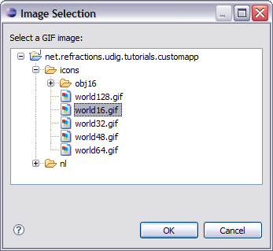
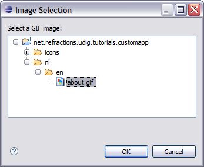

Branding
========

We are now down to the final branding information, the icons used for windows and the image displayed in Help>About.

* Click the
  Branding
  tab

* Click on the browse button next to 16x16 image, select world16.gif.
  |100000000000015B0000013F1CF4DEB8_png|

* In a similar manner take care of:
  icons/world16.gif
  icons/world32.gif
  icons/world48.gif
  icons/world64.gif
  icons/world128.gif

* Select
  nl/en/about.gif
  for the
  About Dialog
  image:
  |100000000000015B0000011C13689B55_png|

* And enter the following Text:

Hello World

This is a custom application generated using the uDig SDK.

For more information visit http://udig.refractions.net.

