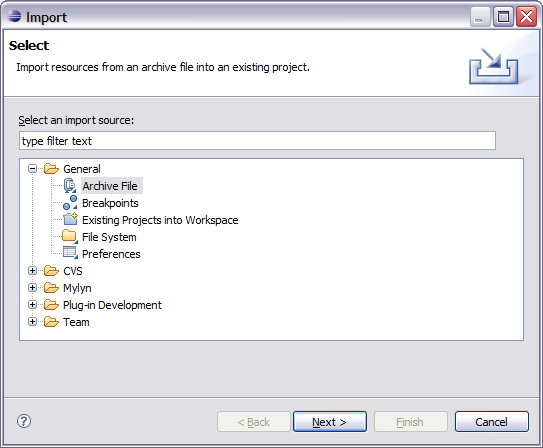
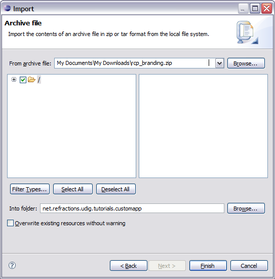
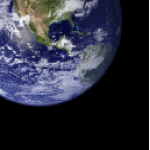
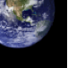

Branding Imagery
================

Now that your branding plug-in is created we need to provide a little bit of content before we get down to coding and configuration. An important aspect of defining a new product is the all important visual identity.

Fiddling around with drawing programs is a bit beyond the scope of this workbook but we can quickly cover what is needed.

* splash.bmp

  .. image:: images/BrandingImagery_splash.png
       :width: 9.26cm
       :height: 5.93cm

  The splash screen must be in bmp format, it is actually read by a C++ program responsible for 
  launching your application. The recommended size for this image is 500x330 pixels.

* about.gif

   .. image:: images/BrandingImagery_about.png
       :width: 1.981cm
       :height: 2.96cm

  The about image is limited to the gif format, the maximum limit is 500x330, for images smaller 
  than 250x330 you have the option of including your own text and html links in the about dialog.

* Window images displayed by the operating system.

  |gif128x128| |gif64x64| |gif48x48| |gif32x32| |gif16x16|

  gif files sized 128x128, 64x64, 48x48, 32x32, 16x16

* Assorted icons

  +---------------+-------------------------------------------------+--+
  | icons/elcl16  | Used on a view tool bar actions.                |  |
  | icons/dlcl16  | (16x16 left and top clear)                      |  |
  |               |                                                 |  |
  +---------------+-------------------------------------------------+--+
  | icons/etool16 | Used in application tool bar and menu bar       |  |
  | icons/dtool16 | (16x16 left and top clear)                      |  |
  |               |                                                 |  |
  +---------------+-------------------------------------------------+--+
  | icons/obj16   | Used in trees to represent objects or ideas     |  |
  |               | (16x16 centered, bottom clear)                  |  |
  |               |                                                 |  |
  +---------------+-------------------------------------------------+--+
  | icons/ovr16   | Used to decorate a obj16 icon to indicate state |  |
  |               | (7x8 one pixel white outline)                   |  |
  |               |                                                 |  |
  +---------------+-------------------------------------------------+--+
  | icons/wizban  | Banner used in wizard dialog windows            |  |
  |               | (55x45 bottom left on a blue gradient)          |  |
  |               |                                                 |  |
  +---------------+-------------------------------------------------+--+

  Enough of that - lets download the files we need and keep going. If you have any questions please consult the `Eclipse User Inferface Guidelines <http://www.eclipse.org/articles/Article-UI-Guidelines/Index.html>`_

* Download the following file: :download:`rcp_branding.zip`

  .. note::
     If you are using this workbook in a lab setting you will find the file rcp_branding.zip on your dvd.

* Select :menuselection:`File --> Import` to open up the Import wizard

* Choose :menuselection:`General --> Archive File` and press :guilabel:`Next`

  |100000000000021F000001C065E7981C_png|

* Fill in the following details on the Archive file page:

  From archive file: :download:`rcp_branding.zip`

  Into folder: ``net.refractions.udig.tutorials.customapp``

  |100000000000021F000002267C4B4FA7_png|

* Press :guilabel:`Finish`, two folders will be added to your project. 

  There is an “nl” folder with language specific branding; and an icons folder.

