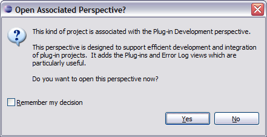
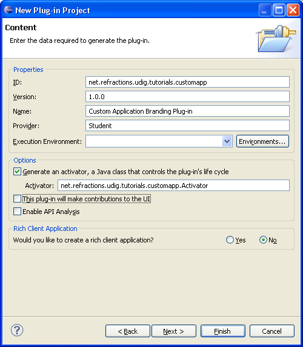
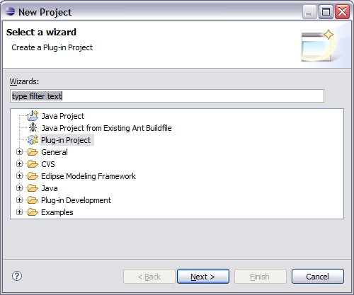

Branding Plugin
===============

In this section we create a plug-in that contains all of the custom “branding” data for our application.

* Select :menuselection:`File --> New --> Project...`

* In the New Project wizard select Plug-in Project from the list and and press :guilabel:`Next`.

  |10000000000001F4000001A12B0DEB32_png|

* On the New Plug-in Project page enter:

  Project name: ``net.refractions.udig.tutorials.customapp``

  |10000000000001F40000023E1031E2AF_png|

* Press the :guilabel:`Next` button

* On the Plug-in Content page provide the following information:

  Plug-in Name: ``Custom Application Branding Plug-in``

  Plug-in Provider: ``Student``

  This plug-in will make contributions to the UI: ``uncheck``

  Execution Environment: ``empty``

  |10000000000001F40000023E5F757D92_png|

* Press :guilabel:`Finish` to continue (we are not interested in using any of the included templates).

* If the Open Associated Perspective dialog pops up you can select :guilabel:`Yes`

  |10000000000001B9000000E298F103F2_png|

* Your new project is added to the Package Explorer, and the ``MANIFEST.MF``
  file will be opened for you to review.

.. |10000000000001F40000023E1031E2AF_png| image:: images/10000000000001F40000023E1031E2AF.png
    :width: 8.16cm
    :height: 9.46cm

