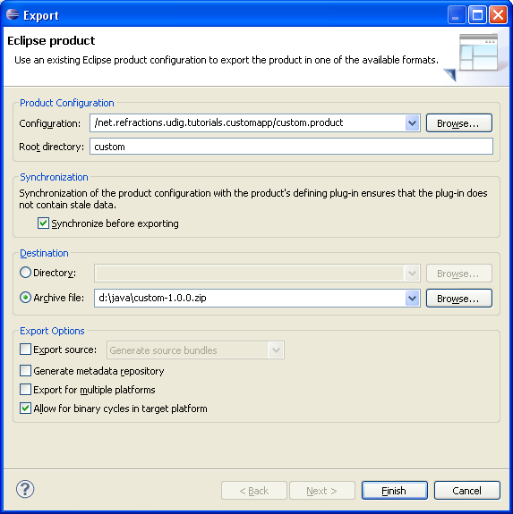

Distribute
==========

This section shows how to export your product for others. We have a couple of things to do before we
get down to running to product export wizard.

Include Images in Branding Plug-in Build
----------------------------------------

Everything that you wish bundled into a plug-in's jar needs to be ticked off as part of the
**build.properties** file.

* We need to make all the files we need are included in our branding plug-in.

* Open up **MANIFEST.MF** and switch to the :guilabel:`Build` tab.

* Check of the following files in the Binary Build::
   icons
   nl
   plugin_customization.ini

  .. image:: images/Distribution_01.png
     :width: 6.429cm
     :height: 5.151cm

* Save the file and we can go on to the next section.

Product Export
--------------

And now we are in a good position to export.

* Open up a file browser and delete the “runtime directory”. 

  .. note::
     This directory (C:\java\runtime-custom.product\) was created when you were trying out the 
     application earlier. Removing this directory has the same effect as clearing the configuration 
     in the run dialog.
  

* Return to the **custom.product** editor. Switch to the :guilabel:`Overview` tab

* Click the :guilabel:`Eclipse Product export wizard` link to open up the Export wizard.

* Change the Root directory field to custom.

* Select the :guilabel:`Archive file` radio button and enter the destination zip file:

  We can also uncheck “Generate metadata repository”

  .. hint::
     If the wizard fails a log file will be saved to the directory you indicate here.

  |100000000000023D0000023FFC9E5315_png|

* Press the :guilabel:`Finish` button

* Please wait: when finished custom-1.0.0.zip will be created.

* Now unzip that folder and run your new application.

  .. note::
     To use this application your end users will need Java installed along with 
     the JAI and ImageIO extensions.

