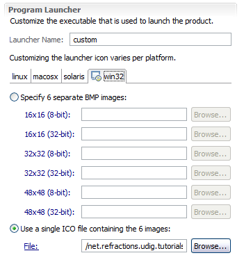

Launching
=========

Eclipse RCP applications are bundled up with a platform specific launcher. You can run your application 
as a normal Java application but this is more fun.

The osgi.parentClassloader=ext argument is used to let runtime system know that we want access to JRE 
extensions (specifically JAI and ImageIO).

* Return to the **custom.product** editor, and change to the :guilabel:`Launching` tab.

* We are going to fill in the the Program Launcher section:

  * Enter custom into the Launcher Name field

  * Under Customizing the launcher icon varies per platform select **win32**

  * Select the :guilabel:`Use a single ICO file containing the 6 images:` radio button

  * Press :guilabel:`Browse...` button and select **icons/world.ico** for the file

* Here is what this looks like when you are done:

  |100002010000015F00000176A71E213B_png|

* Now lets work on the Launching Arguments

  * Select the :guilabel:`All Platforms` tab, and fill the the following VM Arguments::

      -Xmx386M -Dosgi.parentClassloader=ext

    .. hint::
       If you want you can give your application more memory ``-Xmx756m`` is good for working with rasters

  * Select the :guilabel:`macosx` tab and add the following to the existing VM Arguments::

      -Djava.awt.headless=true

* That is it; we have enough information to move along with.

