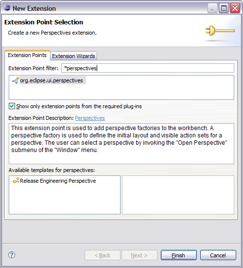
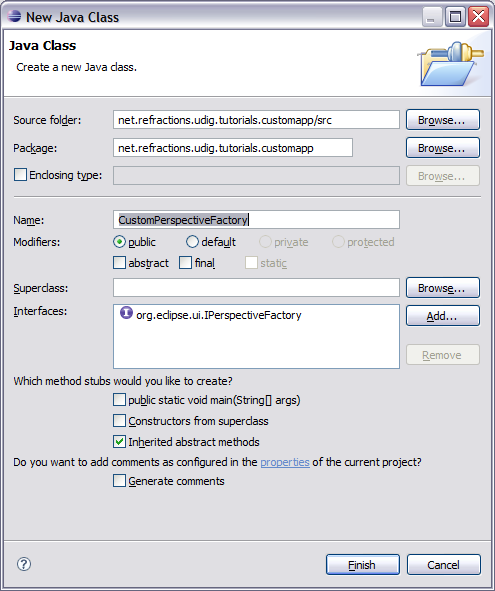
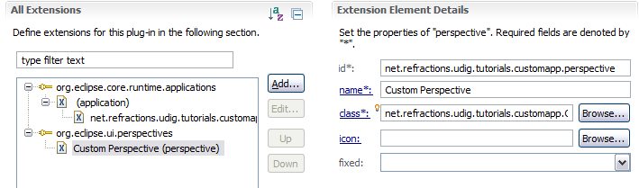
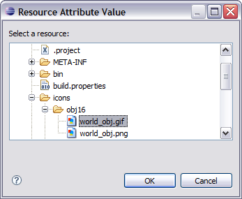

Perspective
===========

Perspectives are used to gather together a screen layout (usually for a specific task).

In the previous section we saw that an application can list a default perspective to use when it 
starts up – this is only used the first time the user runs the application. On subsequent runs 
the application will maintain the arrangement as the user left them.

* Return to the Extension editor.

  It is the editor titled: **net.refraction.udig.tutorials.customapp**, make sure the editor 
  is still on the Extensions tab.

* Press :guilabel:`Add...` button and select **org.eclipse.ui.perspectives**

  |10000000000001F400000226FA164E05_png|

* Press :guilabel:`Finish`

* Select the name element.

  **id:** org.locationtech.udig.tutorials.customapp.perspective

  **name:** Custom Perspective

  **class:** org.locationtech.udig.tutorials.customapp.CustomPerspectiveFactory

  |10000201000002C5000000D17802F89A_png|

* Click the :guilabel:`Browse` button after icon and select world_obj.gif

  |100000000000015B0000011D6A55A270_png|

* Save the file, click the class link to open the Java Class dialog.

  |10000000000001EF0000024FD8F78535_png|

* Press :guilabel:`Finish` to create the class.

* Add the following static constants:

  .. code-block:: java

     private static final String BOOKMARKS = "org.tcat.citd.sim.udig.bookmarks.internal.ui.BookmarksView";

     private static final String PROJECTS = "org.locationtech.udig.project.ui.projectExplorer";

     private static final String LAYERS = "org.locationtech.udig.project.ui.layerManager";

* In the createInitialLayout method, add the following code:

  .. code-block:: java

     layout.addFastView(PROJECTS);

     layout.addView(LAYERS, IPageLayout.LEFT, 0.3f, IPageLayout.ID_EDITOR_AREA);

     layout.addView(BOOKMARKS, IPageLayout.BOTTOM, 0.7f, LAYERS);

