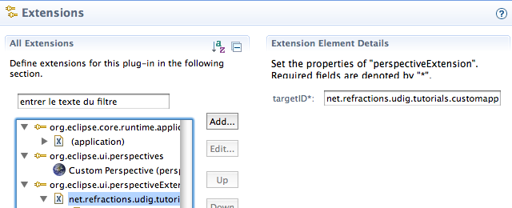
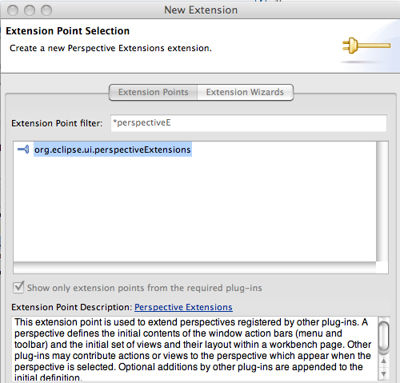
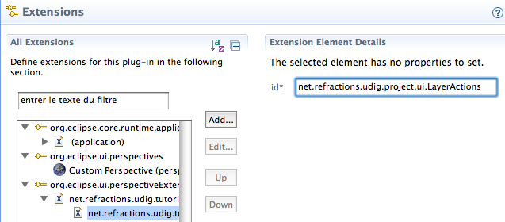

Perspective Extensions
======================

In the previous section we used one method for defining a perspective – we used code to manually add views to the perspective. We will now use a second technique – using a plugin.xml extension to declare what a perspective is composed of.

To control what menus are shown we will use an extension to add an Action Set to a perspective. The “Perspective Extensions” extension point can be used to control what actions are available, what views are displayed and so forth.

* Open the
  plugin.xml
  file.

* Switch to the
  Extensions
  tab

* Click the
  Add...
  Button

* Select
  org.eclipse.ui.perspectiveExtensions
  |10000000000001F4000001DF52717268_png|

* Press
  Finish

* Select the
  targetID
  element and enter
  net.refractions.udig.tutorials.customapp.perspective

  Save the Manifest.
  |10000000000002800000010448246634_png|

* Right click on
  net.refractions.udig.tutorials.customapp.perpsective
  and select
  New > actionSet

* Select the
  id*
  field and enter:
  net.refractions.udig.project.ui.LayerActions
  |100000000000027D000001189B8695B9_png|

* Repeat this process for the following additional entries:
  net.refractions.udig.project.ui.layer.menu
  net.refractions.udig.project.ui.map.menu
  net.refractions.udig.catalog.ui.data.menu
  |20000007000039E200001BB48FF2D36F_svm|

.. |20000007000039E200001BB48FF2D36F_svm| image:: images/20000007000039E200001BB48FF2D36F.svm
    :width: 10.37cm
    :height: 4.96cm

