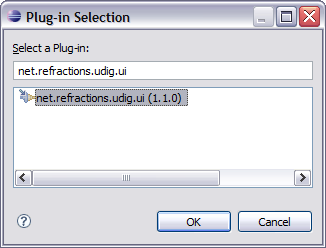
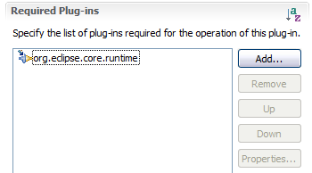
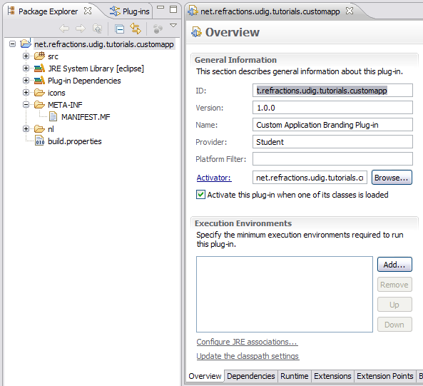

Plugin Dependencies
===================

The plug-in MANIFEST.MF file is used to define the requirements and capabilities of any plug-in. You will recognize a lot of the information here from when you defined the plug-in.

* Open the MANIFEST.MF file:
  |10000201000002510000021DFB2A863D_png|

* Switch to the
  Dependencies
  tab.

* Press the
  Add
  button in the
  Required Plug-ins
  section.
  |100002010000015E000000C28304E1EB_png|

* Select the
  net.refractions.udig.ui
  plug-in and press
  OK.
  |1000000000000146000000F851DB08F7_png|

* Select
  File > Save
  from the menu bar to save the file.
  This step is important as it gives the MANIFEST.MF a chance to generate:

* The
  .classpath
  file used by the Java build system

* The
  .project
  file used by the IDE

* With this information in place the wizards and dialogs we used in the next section will be able to find classes defined by the
  net.refractions.udig.ui
  plug-in.

