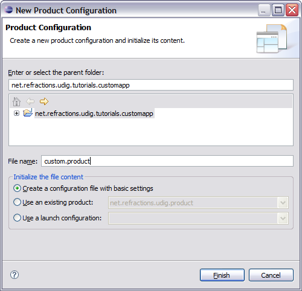
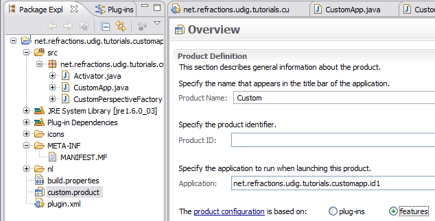
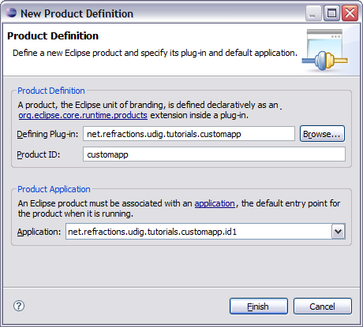

Product
=======

Now that we have an application we can bundle it up as a product for others, and how it is to be run.

To start lets add a product file to our branding plugin:

* Select
  net.refractions.udig.tutorials.customapp
  in the Project Explorer

* Selection
  File > New > Product Configuration

* Select
  net.refractions.udig.tutorials.customapp

* Enter
  custom.product
  in the File name field
  |10000000000001F4000001E262060AA2_png|

* Press the
  Finish
  button.

* The
  custom.product
  file is created and opened for your review.

* We are going to fill in the blanks defining our product.
  Name:
  Custom
  Application:
  net.refractions.udig.tutorials.customapp.id1
  The product configuration is based on:
  features
  |100002010000027A0000014398B76B0C_png|

* Save your work and hit the
  New...
  button next to
  Product
  .

* In the Product Definition wizard enter:
  Product ID:
  custom
  |10000000000001CC0000019F135B97B6_png|

* Press the
  Finish
  button and save your work.

