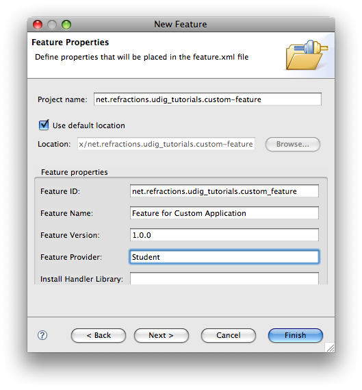
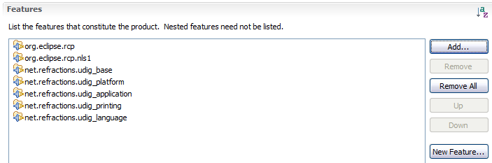
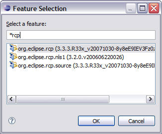

Product Configuration
=====================

We are going to use “features” (ie groups of plug-ins) to define what is included in our application. We will making use of features provided as part of eclipse rcp, features provided as part of the uDig SDK

and we will make one feature to hold our branding plugin.

* Change to the :guilabel:`Dependencies` tab, we are going to be defining this product 
  in terms of the features we require to be present.

* Press :guilabel:`Add...` and select **org.eclipse.rcp** from the list.

  |10000000000001460000010E547BE502_png|

* Press the :guilabel:`OK` button to add the feature.

* In the same manner add the following features:

  * **net.refractions.udig_base**

  * **net.refractions.udig_platform**

  * **net.refractions.udig_application**

  * **net.refractions.udig_printing**

  |10000201000002BF000000E90443EC06_png|

* We now need to define a feature to hold our branding plugin (so it is included in the product!).

* Pressing the :guilabel:`New Feature...` button (located in the title area).

  |100002010000001600000017D213821A_png|

* In the New Feature wizard enter the following values:

  **Project name:** net.refractions.udig_tutorials.custom-feature

  **Feature Name:** Feature for Custom Application

  **Feature Provider:** Student

  |100002010000021100000239850089D9_png|

* Press the :guilabel:`Next` button.

* On the Referenced Plug-ins and Fragments page select:

  * net.refractions.udig.tutorials.customapp

  * net.refractions.udig.tutorials.distancetool (optional)

* Press :guilabel:`Finish`

