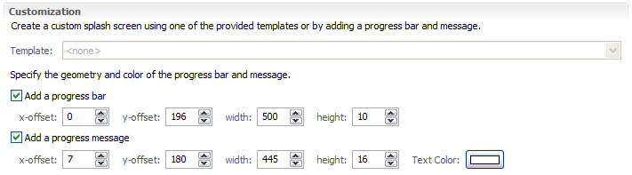

Splash
======

The splash screen is displayed by the launcher to give the user something to watch as Java loads up; later on in the start up process a progress bar is drawn over top of the splash screen.

|10000000000001F400000140ABE9E3B4_png|

When making your own splash screen you will want to plan out the location of the progress bar and progress message as shown above.

* Select the
  Splash
  tab

* Check the
  Add a progress bar
  check box and enter:

* Enter
  0
  in the x-offset field

* Enter
  196
  into the y-offset field

* Enter
  500
  in the width field

* Enter
  10
  in the height field

* Check the
  Add a progress message
  check box and enter:

* Enter
  180
  into the y-offset field

* Enter
  16
  into the height field

* Change the Text color to
  white
  |10000201000002C7000000C57E07D887_png|

