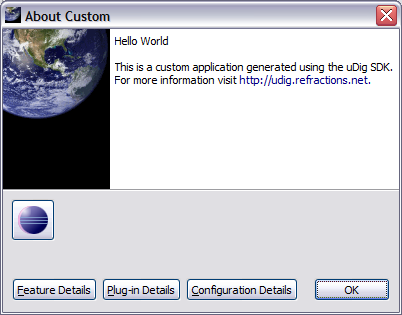
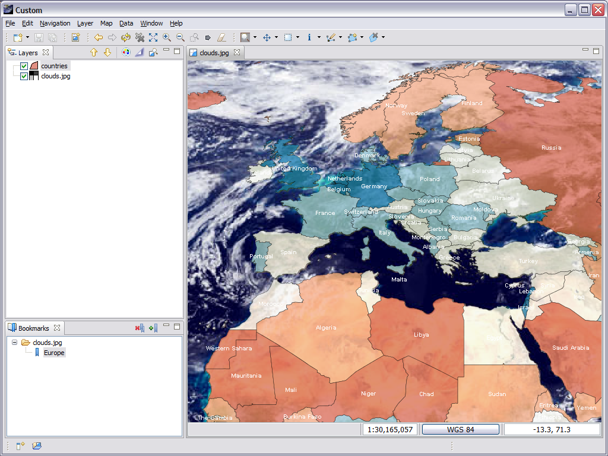

Try It Out
==========

* Select the :guilabel:`Overview` tab

* Click the synchronize link in the Testing section

* Click the :guilabel:`Launch an Eclipse application` link, check that your splash 
  screen with progress bar and progress message works

* Drag a few files on to the screen and try out the application.

  |1000000000000400000003004463E217_png|

* The application defaults to our Custom perspective, to switch perspectives 
  use :menuselection:`Window --> Open Perspective --> Other`

* Open up :menuselection:`Help --> About` and have a look at the branding info.

  |10000000000001920000013B4347A98B_png|

* Use :kbd:`ALT` + :kbd:`TAB` to switch between windows, look at the window icon.

