SDK Quickstart
##############

 |udig_logo_gif| |refractions_png| |lisasoft_png| |camptocamp_logo| |sponsor_logo| |hydrologis_logo| 

.. image:: ../../../images/background.png
   :width: 100%

.. |refractions_png| image:: ../../../images/refractions_logo.png
   :height: 2.8cm

.. |lisasoft_png| image:: ../../../images/lisasoft_logo.png
   :height: 2.8cm

.. |udig_logo_gif| image:: ../../../images/udig_logo.gif

Introduction
============

This workbook is aimed at those doing plug-in development against the uDig platform. Follow these instructions 
to quickly set up a development environment for working on your own plug-ins.

Eclipse is familiar to most developers as a Java Integrated Development Environment (IDE). The Eclipse IDE 
can be extended with additional “capabilities” to work with alternate programming languages (like C++ or Ruby), 
or additional subject matter such as Java Enterprise Edition or in this case Eclipse Plug-in development.

In this Quickstart we are going to use the Eclipse Plug-in Development capability; with the uDIG SDK as the 
target platform. This workbook covers setting up a development environment for working on your own plug-ins.

If you have an existing Eclipse installation please do not skip this tutorial – we are going to very carefully 
set up a copy of Eclipse with a few more additional tools then you are perhaps used to.

The Eclipse developers themselves make use of the Plug-in Development Environment (PDE) day in and day out – 
so it has gotten a lot of polish over the years. In some respects it is more polished then the Java development 
environment (with custom editors for all kinds of little files).

Some of the terminology used when working with the PDE:

* Everything is a **Plug-in**

* A plug-in can implement an **extension**

* A plug-in can provide an **extension-point** for others

Please keep these ideas in mind – even an “Application” is considered an extension when working with the 
Eclipse Platform.

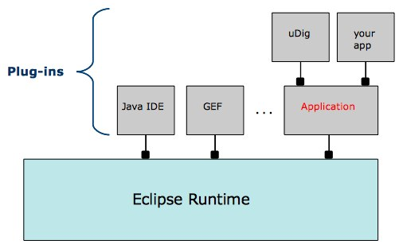

Downloads
=========

We are going to start by downloading all the software we need; we will be able to proceed with installation 
as we wait for some of the larger downloads.

.. note::
   If you are using this work book in a lab setting you will find these downloads available on your course DVD.

* For uDig 1.2 we are going going to download the latest SDK from here:

  `<http://udig.refractions.net/download/>`_

  Early access downloads are available here:
 
  `<http://udig.refractions.net/download/unstable/>`_

  Normally you would grab the latest stable SDK from the public uDig download page.
  At the time of writing the latest uDig SDK was: udig-1.3-SNAPSHOT.zip

* Visit and click on the link for “Eclipse Modeling Tools” and download the appropriate:

  |eclipse_modeling_tools_png|

  Tested with `Eclipse Indigo 3.7.2 Packages <http://www.eclipse.org/downloads/packages/eclipse-modeling-tools/indigosr2>`_ :

  `eclipse-modeling-indigo-SR2-win32.zip <http://www.eclipse.org/downloads/download.php?file=/technology/epp/downloads/release/indigo/SR2/eclipse-modeling-indigo-SR2-win32.zip>`_

* We have prepared an “dropins” download in the following folder:

  `<http://udig.refractions.net/files/downloads/extras/>`_

  This download includes a developers guide for udig, platform language packs, and a resource bundle editor.

  At the time of writing: **dropins-3.7.2.zip**

* Download a Java Runtime Environment from this folder:

  `<http://udig.refractions.net/files/downloads/jre/>`_

  This is a special JRE that has been extended with Java Advanced Imaging and Image IO and GDAL for 
  spatial image formats.

  .. note::
     GDAL support is provided by the imageio-ext project started by GeoTools alumni.

  At the time of writing: **jre1.6.0_25.win32_gdal_ecw.zip**

* Download Eclipse RCP Delta Pack

  `<http://download.eclipse.org/eclipse/downloads/eclipse3x.html>`_

  Download the RCP-Delta Pack from you will need to choose the "Latest Release" build; and the scroll 
  down to the "Delta Pack" link to download.

  At the time of writing: `eclipse-3.7.2-delta-pack.zip <http://download.eclipse.org/eclipse/downloads/drops/R-3.7.2-201202080800/download.php?dropFile=eclipse-3.7.2-delta-pack.zip>`_

  .. hint::
     Please ensure your eclipse and jre match (both win32 – or both win64).

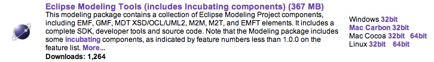

Eclipse SDK Installation
========================

When your eclipse download has finished and we can begin to installation.

* Create a folder\: :file:`C:\\java\\`

* Unzip the downloaded `eclipse-modeling-indigo-SR2-win32.zip <http://www.eclipse.org/downloads/download.php?file=/technology/epp/downloads/release/indigo/SR2/eclipse-modeling-indigo-SR2-win32.zip>`_ 
  file to your directory – the folder :file:`C:\\java\\eclipse` will be created

  .. warning::
     Unzipping using windows does not support long filenames.

  |install_eclipse_png|

  .. hint::
     If you need a good program to unzip archive files try `7zip <http://www.7-zip.org>`_.

* Open up the jre zip file Drag from the 7zip window.

  |install_jre_7zip_png|

* Drop into your :file:`C:\\java\\eclipse`

  |install_jre_png|

  .. hint::
     The folder must be called “jre” for the :command:`eclipse.exe` to recognize it.

* Unzip the dropins file to your eclipse/dropins folder. The download will add additional plug-ins 
  and features to to your eclipse installation without getting mixed up with the bare-bones eclipse.

  .. warning::
     Be careful when extracting this zip not to get something silly like dropins/dropins.

  |install_dropins_png|

* Navigate to :file:`C:\java\eclipse` and right-click on the :command:`eclipse.exe`
  file and select :menuselection:`Send To --> Desktop (create shortcut)`.

  .. note::
     You may want to modify the “eclipse.ini” file to specify additional command line 
     options such as more memory.

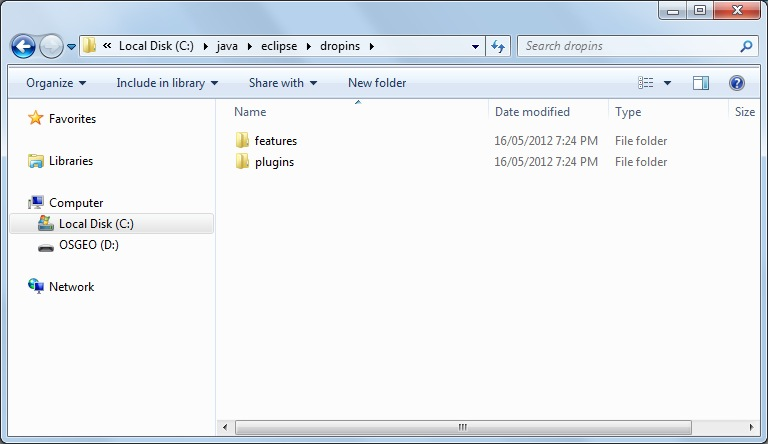

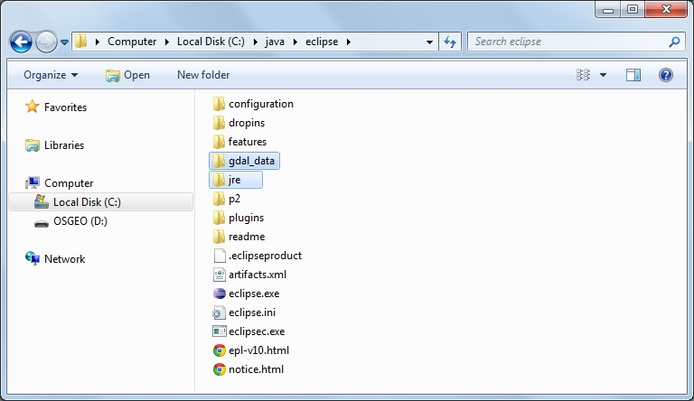

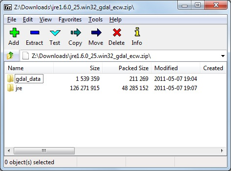

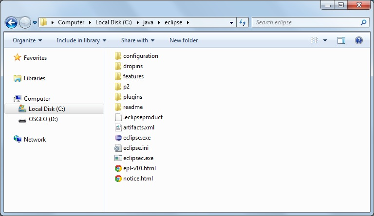

Eclipse Workspace
=================

The Eclipse IDE keeps track of what you are doing in a workspace. You can have several workspaces (often 
for different projects) each with its own configuration.

* Double click on your desktop short cut to start up eclipse. When you start up eclipse for the first 
  time it prompt you for a workspace.

* Choose a workspace for your sdk development: :file:`C:\\java\\workspace`

  |eclipse_workspace_jpg|

* Wait a few moments while eclipse starts up.

* On the Welcome view press the :guilabel:`Workbench` button along the right hand side.

  |eclipse_welcome_jpg|

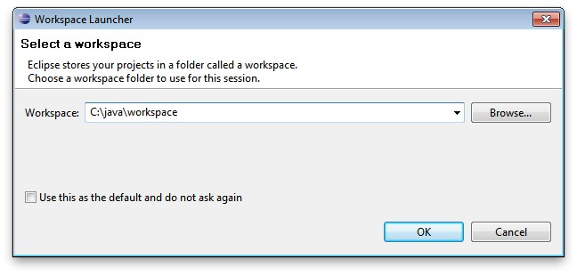

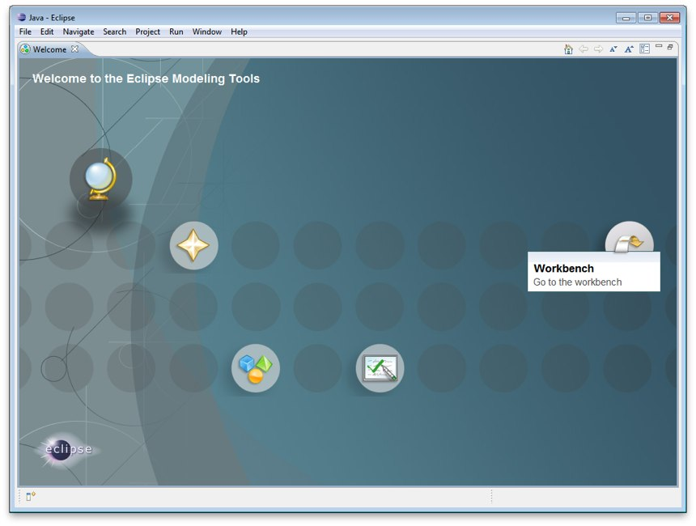

Eclipse Preferences
===================

We have a few global settings to configure before we can proceed.

.. note::
   We are waiting for a Mac OSX JRE to be available before using Java 7.

* Open up :menuselection:`Window --> Preferences` from the menu bar.

* Navigate to the :menuselection:`Java --> Compiler` page and change:

  * Compiler compliance level: 1.6

* Check the :menuselection:`Java --> Installed JREs` page:

  * Should have Location: :file:`C:\\java\\eclipse`

    If the setting is not correct you can use the :guilabel:`Add..` button and create a 
    JRE entry for :file:`C:\\java\\eclipse`

  * You can press :guilabel:`Edit` to look at the installed JRE.

    Regardless of platform we are interested in making sure :file:`jai_core.jar`, :file:`jai_imageio.jar` 
    and :file:`jai_codec.jar` are available.

  |jre_definitino_jpg|

  .. note::
     On OSX we are not able to provide a JRE for you to download – uDig will install JAI and ImageIO when 
     run for the first time.

  * As a result of these changes, Eclipse may prompt you to perform a clean build.

    Simply accept this request; it won't take long since we don't yet have any source code.

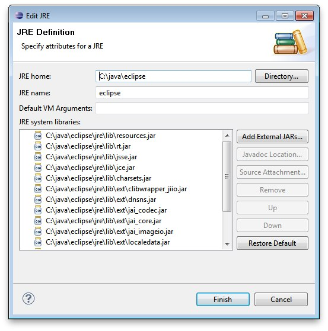

uDIG SDK
========

We are now going to unpack the udig sdk and use it as our plug-in target platform.

* Extract the **udig sdk** download into :file:`C:\\java\\target\\udig_sdk`

* Extract the **eclipse-delta-pack** download into :file:`C:\\java\\target\\eclipse`

* You will be left with the following directory structure:

  |install_delta_png|

* Go back to eclipse and open :menuselection:`Window --> Preferences`.

* Select the :menuselection:`Plugin Development --> Target Platform` page.

* Press the :guilabel:`Add` button to start a new target definition.

* Choose :guilabel:`Default` as we are going to include the eclipse plugins.

  |target_platform_definition_png|

* Press :guilabel:`Next` to continue. This will open the “Target Content” page.

* Press the :guilabel:`Add` button and add a Directory. Choose the :file:`C:\\java\\target\\eclipse` 
  directory where you unpacked the eclipse-delta-pack.

  |target_platform_add_eclipse_png|

* Press :guilabel:`Add...` again and add the :file:`C:\\java\\target\\udig_sdk` directory.

  |target_platform_add_sdk_png|

* Change the name to “uDig SDK” and confirm all three folders are listed.

  |target_platform_locations_png|

* Press :guilabel:`Finish` to complete the “uDig SDK” target platform.

* Back in the **Target Platform** preference page tick the checkbox next to the “uDig SDK” 
  so it will be the Active target platform.

* Press :guilabel:`OK`.

At this point all the source code for the Eclipse and uDig plug-ins are available. We can now start 
working on uDig plug-ins, but before we do that lets try running the application.

.. hint::
   If you get a message indicating the SDK is newer then the version of eclipse you 
   are running – then these instructions are out of date!

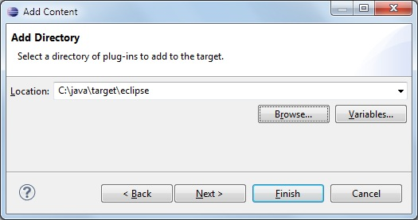

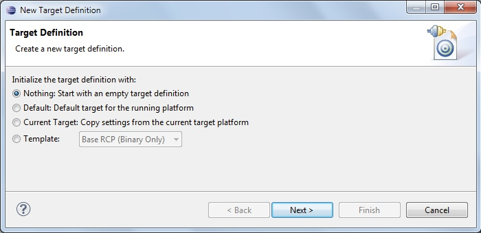

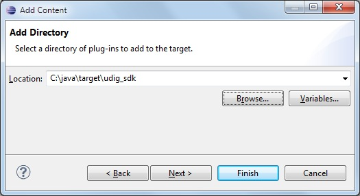

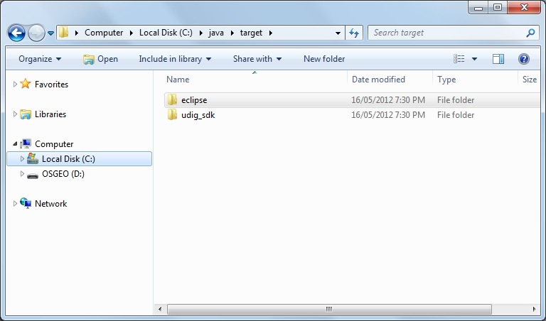

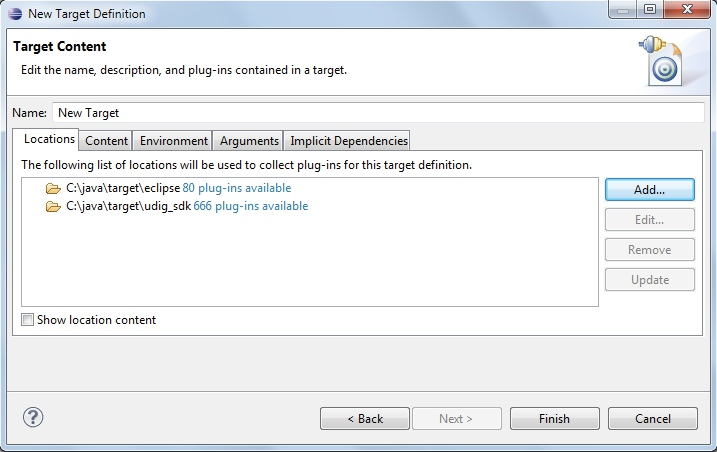

Running uDig
============

With all this in place we can now run the uDig application from your development environment. This is a 
good way to test that everything is installed correctly.

* To start out with we will switch to the **Plug-in Development** perspective; 

  In the top right of the toolbar you can choose **Other** to open the Open Perspective dialog

  |perspective_other_jpg|

* Chose **Plugin-Development** from the list and press :guilabel:`OK`

  |perspective_open_jpg|

* Click on the :guilabel:`Plugins view` and right click on **net.refractions.udig** plug-in the list. 
  Select :menuselection:`Import As --> Source Project` to copy the plugin into your workspace.

  |import_source_project_jpg|

* Change to the :guilabel:`Package Explorer` view and open up the **net.refractions.udig** plugin and 
  double click to open **udig.product**.

* Switch to the :guilabel:`dependencies` tab as we have a little bit of clean up work.

  Remove the line for net.refractions.udig_language-feature. Select net.refractions.udig-feature and press 
  :guilabel:`Properties` button. Remove the version and press :guilabel:`OK`.

  The result should look like:

  |product_dependencies_png|

* Return to the :guilabel:`overview` tab of **udig.product** click on the :guilabel:`Launch Eclipse Application`
  link (it is located under testing as shown below).

  |product_launch_png|

* The application will now start!

  |udig_welcome_jpg|

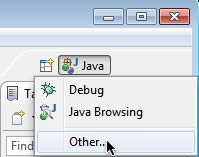

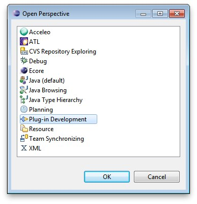

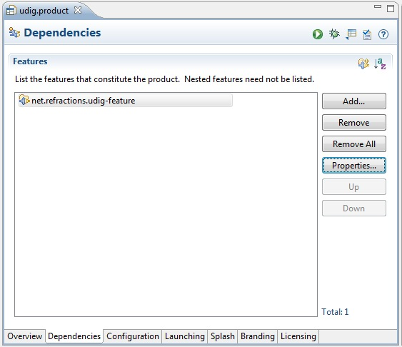

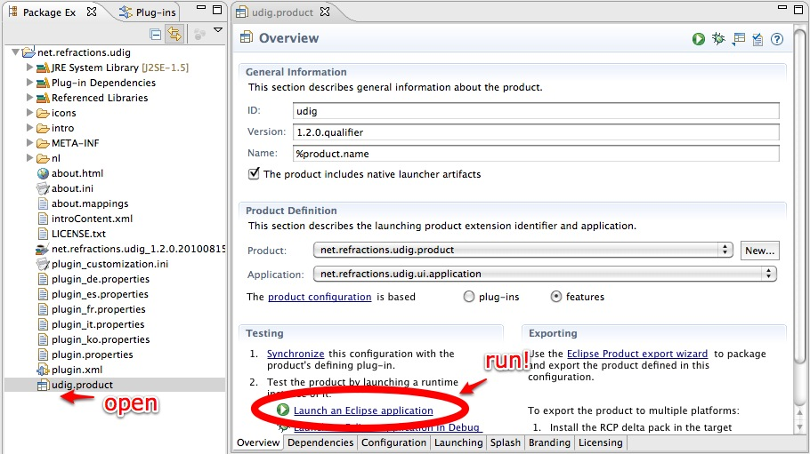

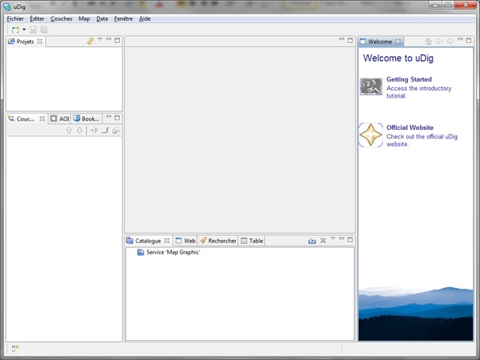

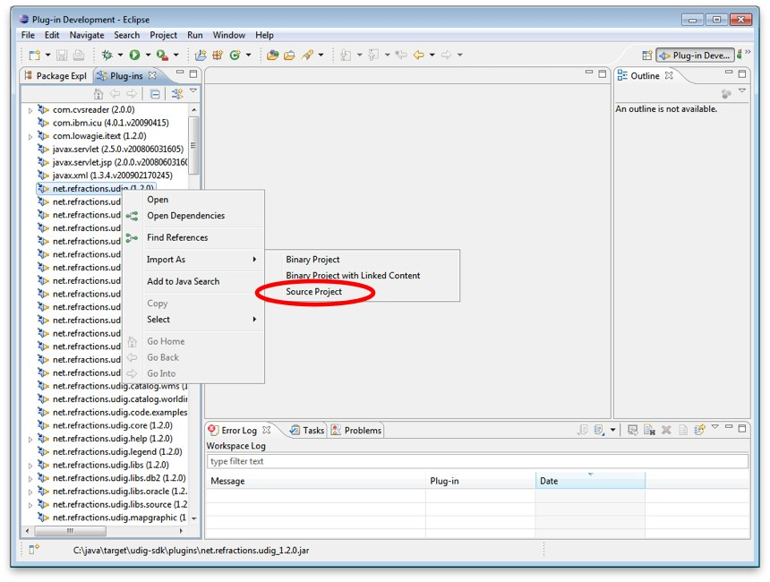

What to Do Next
===============

Here are some additional things to try when running uDig.

* From Eclipse open up :menuselection:`Run --> Run Configurations` to examine or customize configuration 
  of uDig you are running. Many of these fields were filled in for you by the udig.product.

* The number one tip is to go to the Arguments tab and enable console logging. To send log information to 
  the console as udig runs add::

  -consolelog

  to your “program arguments”.

  |run_arguments_jpg|

  You can also review the VM arguments; including changing the amount of memory available to your uDig 
  application::

  -Xmx512m

  may be useful when working with large images? The::

  -Dosgi.parentClassload=ext

  setting allows uDig to find JRE extensions such as Java Advanced Imaging and ImageIO.

  .. hint::
     For documentation on these command line parameters check the eclipse help menu.

* The running uDig application makes use of the “Workspace Data” folder defined in the Run dialog. Try checking
  clear and workspace in order to simulate starting uDig from a fresh install.

  |run_main_jpg|

* Have a look on the Tracing tab of the Run dialog; you can control the amount of logging 
  information produced (for example WMS logging is turned on below).

  .. hint::
     Tracing is especially useful when the -consolelog program argument is used.

  |run_tracing_jpg|

* Have a look at the plug-ins tab and see if you can turn off: printing support.

  .. hint::
     Normally the plugins included by an application are organized into features – we will cover 
     how to do this in the :doc:`Custom Application Tutorial <../CustomApplication/CustomApplication>`.

  |run_plugins_jpg|

* Advanced: When working on the uDig project itself we use the FindBugz tool to check for obvious 
  mistakes prior to committing. You can add FindBugz to your environment using the following update site:

  `<http://findbugs.cs.umd.edu/eclipse>`_

  |install_findbugs_jpg|

.. |run_tracing_jpg| image:: images/run_tracing.jpg
    :width: 15.199cm
    :height: 11cm

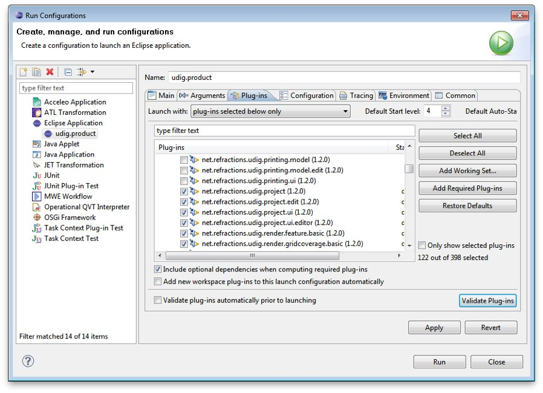

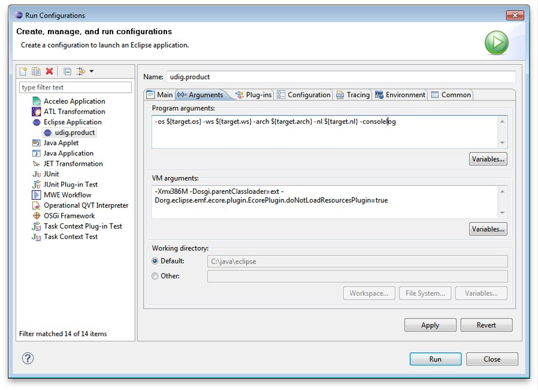

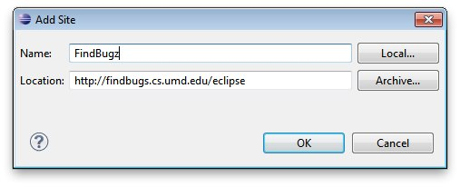

.. |run_main_jpg| image:: images/run_main.jpg
    :width: 15.199cm
    :height: 11cm

Tips, Ticks and Suggestions
===========================

The following tips, tricks and suggestions have been collected from the udig-devel email list. If
you have any questions feel free to drop by and introduce yourself.

ClassNotFoundException at EclipseStarter
----------------------------------------

If your uDig application fails to load due to a ClassNotFoundException at 
org.eclipse.core.runtime.adaptor.EclipseStarter then we have a problem with the plugin dependencies. 
The EclipseStarter is doing its best to load the UDIGApplication; however the UDIGApplication is 
not available as the Platform refused to load the net.refractions.udig.ui plugin as some of the 
dependencies were not available.

This usually happens each time we update the version of Eclipse we use. Each version of eclipse
changes the plugins required; requiring us to review and examine the plugins we include in our SDK.

As a temporary measure:

#. Open up your Run Configuration
#. Navigate to the Plugins tab
#. Hit "Verify Plugins" (to list the plugins that failed to load; you should see that 
   net.refractions.udig.ui is in this list)
#. Hit add required plugins

Please email the `udig-devel <http://lists.refractions.net/mailman/listinfo/udig-devel>`_ list; and 
volunteer to test the SDK with the version of eclipse you are using.

NoClassDefFoundError JAI
------------------------

The class JAI is provided as part of the custom **jre** you downloaded. In order for uDig to see
this class it needs to be run using the "ext" classpath. This information is part of the
udig.product file you run during the SDK Quickstart.

For reference here is the command line option it sets:: 

   -Dosgi.parentClassloader:ext

Linux
-----

Please follow the same procedure; there is a "prepackaged" JRE available for you in our
`http://udig.refractions.net/downloads/jre/ <http://udig.refractions.net/downloads/jre/>`_ folder.

Please don't do anything tricky like trying to "app get" a copy of Eclipse and Java; version numbers
are important and we are setting up this environment very carefully.

If you would like to patch up your system Java you can do so by installing the versions of JAI and
ImageIO mentioned above.

Mac OS-X
--------

The Java included with your operating system is "good enough" for now - JAI is already installed on
Tiger and Leopard. Some raster formats may not work out.

How to build uDig from Source Code
----------------------------------

If you are interested in taking part on trunk development please consider `these instructions for
checking out and building uDig <http://udig.refractions.net/confluence/display/ADMIN/02+Development+Environment>`_.

JVM Terminated with Exit Code=-1
--------------------------------

If you have a really old machine with lots of versions of Java installed you may be in trouble! If
you start eclipse and big dialog saying **JVM Terminated with Exit Code=-1** then add the following
to your command line options::

   -vm C:\java\eclipse\jre\\bin\javaw.exe

This will force :command:`eclipse.exe` to use the jre you downloaded.

