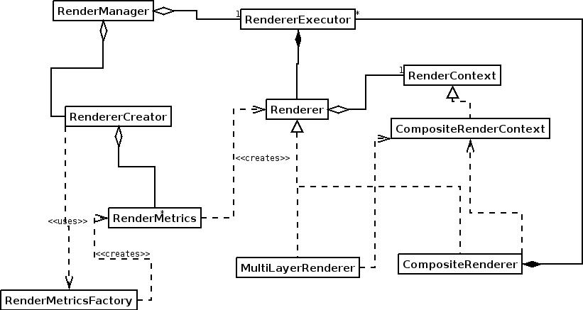
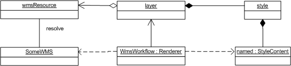
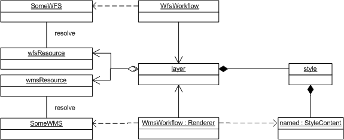
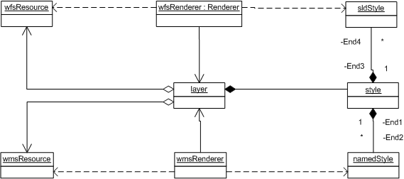

Renderers
=========

Renderers bring to gether information and put it on the screen.

The interesting thing about the uDig renderering system is it is **adaptive**. The correct
geospatial inforamtion is brought together based on the available metadata information (such as
style or performance metrics).

Related:

* `https://www.ibm.com/developerworks/java/library/j-2dswt/ <https://www.ibm.com/developerworks/java/library/j-2dswt/>`_

Renderer Interface
------------------

Renderers are associated with layers, and are specific to a GeoResources.

A renderer is chosen if:

#. It can render the layer using an available GeoResource.
#. It can style the layer. The renderer capable of the most accurate styling is chosen if both 1 and
   2 are satisfied.
#. It is optimized for the particular GeoResource type.

A Renderer class implements one of:

-  Renderer interface: is responsible for renderering a **single** layer.
-  MultiLayerRenderer interface: is responsible for renderering multiple layers

Making it Easy to Implement
---------------------------

Through the Map datastructure you have access to rather a lot of information, to make matters easier
we have gathered together the "useful" information for you ... into a **RenderContext**. The Pattern
police call this a Facade, we call it easier.

Each renderer is provided with a context:

-  Renderers get a IRenderContext
-  MultiLayerRenderers get a ICompositeRenderContextfor (A ICompositeRenderContext contains a set 
   of IRenderContexts, not necessarily ordered).

The context objects provide access to the Map data model, provide useful methods, have methods to
access the layer and GeoResource that the renderer must use and render and contains the image that
the renderer must render to.

The Big Picture
---------------



.. list-table::
   :widths: 20 80
   :header-rows: 1

   * - Object
     - Task
   * - RenderManager
     - Responsible for creating renderers and triggering refreshes.
   * - RendererCreator
     - The default implementation uses a renderer creator to create renderers. The default implementation
       chooses a renderer based on the criteria mentioned earler.
   * - RenderMetricsFactory
     - Can create the RenderMetrics for a given renderer. It is the class that is created from Extensions.
       It has a short cut method that can detect whether a resource will ever be able to render the
       resource.
   * - RenderMetrics
     - Provides information on whether the renderer can correctly style a layer, if it the renderer has
       been optimized for rendering the resource and whether more resources can be added to the context
       object (in the case where the renderer is a MultiLayerRenderer). It also creates the renderer. The
       RenderMetrics is provided with a RenderContext to make these calculations. The Metrics **MUST** base
       its information on the assumption that the renderer will use the GeoResource provided by the
       RenderContext.
   * - RendererExecutor
     - Each renderer has an executor that runs the renderer in a separate thread. There are currently 3
       implementations. One for each type of renderer. (Composite/MultiLayer/Renderer). The
       CompositeRendererExecutor provides the incremental update functionality.
   * - Renderer
     - Renders a resource, specifically, the resource referenced by the RenderContext. The renderer is
       responsible for listening to their resource and triggering updates when the resource changes.
   * - MultiLayerRenderer
     - Takes a CompositeRenderContext and renders all the resources in the contexts into the image obtained
       from the composite RenderContext.
   * - CompositeRenderer
     - Creates a seperate renderer for each context in the CompositeRenderContext. Each Renderer is
       assigned to its own RenderExecutor. (The Standard implementation uses the same RendererCreator as
       the RenderManager).
   * - RenderContext
     - A RenderContext is a facade into the system in addition to having references to the Layer that the
       Renderer must render as and the GeoResource that the will be used by the renderer. Finally the
       RenderContext contains the image that the Renderer must render to and has a number of generally
       useful methods.
   * - CompositeRenderContext
     - A CompositeRenderContext contains a set of RenderContexts. The image that is rendered to is the
       image contained by the CompositeRenderContext, the contained RenderContexts will not be rendered to.

:doc:`render_creation`


Being Adaptive
--------------

As mentioned at the start of the page, uDig makes use of metadata and metrics to figure out which
Renderer is best suited to the task at hand.

Lets see how this works with a quick example.

Example One: Named Style
````````````````````````



   A layer makes use of a WMS GeoResource, a NamedStyle from the Blackboard, 
   this results in a WMSRenderer being chosen to draw onto the screen.

.. note::
   Just because a WMS is being used to draw does not prevent other tools from using the layer in
   a different manner.



   An editor makes use of the same layer, this time a WFS is used to access the real Feature data

Example Two: Named Style and SLD
````````````````````````````````

Note that several renderers may draw from the same layer at once.



   This time a custom SLD style is being used to draw the "selected" features


Available Rendering Technology
------------------------------

Streaming Renderer
``````````````````

uDig currently uses **StreamingRenderer** as a general purpose feature renderer.

There is an optimized **ShapefileRenderer** which is used to render shapefiles only. The shapefile
renderer can only render data from shapefiles but it can do so at speeds from 20-500% faster than
StreamingRenderer. Both feature renderers are fully SLD compliant.

Web Map Server
--------------

A Web Map Server can be used to perform "portrayal" on the server side allowing you to retrieve a
generated image for the area in place.

GlassPane
`````````

The glasspane is a draw2D interface that you can use to draw directly onto the image drawn on the
screen.

It does not use any of the rendering classes and does not listen to events.  If you want to update
the screen and cause the GlassPane to be redraw you must call ViewportPane.repaint().

The glass pane is owned by the ViewportPane.  A ViewportPane can only have a single GlassPane.

The GlassPaneSite is an AbstractContext that contains the viewport model and helper functions to
convert from screen to world and world to screen coordinates.  It is similar to the RenderContext
associated with renderers.  Each GlassPane will have a single GlassPaneSite.

.. figure:: /images/renderers/glasspane.png
   :align: center
   :alt: 

As shown in the following code snippet (from the ViewportPainter) the GlassPane is drawn after the
background image (from the render manager) and before the draw commands.

.. code-block:: java

        public void paint( ViewportGraphics g, Image image, int minWidth, int minHeight ) {
            processCommands(g, true);
            clearPane(g, minWidth, minHeight);
            g.drawImage(image, 0, 0, minWidth, minHeight, 0, 0, minWidth, minHeight);
           
            //draw glass pane
            drawGlassPane(g);
           
            processCommands(g, false);
            runEditFeatureCommand(g);
        }

Example of GlassPane
````````````````````

Two examples of using a glass pane can be found in the net.refractions.udig.tutorials.tracking
tutorial.

-  SeagullGlassPaneOp - This adds an operation to the map.  When executed a glass pane is added to
   the map that draws seagulls. The map image is updated on a timer and the seagulls randomly moved
   based on another timer.
-  SeagulTool - This is a modal tool that when activated adds a glasspane to the viewport pane and
   draws a set of seagulls on the screen. These seagulls will follow your mouse around the screen
   until the tool is deactivated.

Here are some subsets of code from these examples showing you how to add a new glass pane to the
viewport pane and setup a timer to update the map at given intervals.

This code examples shows how to add a GlassPane to a given ViewportPane. In this example the draw()
function is drawing the seagulls on the screen.

.. code-block:: java

     private void addFlockGlassPane(ViewportPane p, final Collection<Seagull> gulls){
            p.setGlass(new GlassPane(p){

                @Override
                public void draw( GC graphics ) {
                    for( Iterator<Seagull> iterator = gulls.iterator(); iterator.hasNext(); ) {
                        Seagull bird = (Seagull) iterator.next();
                        bird.drawSeagull(graphics, this);
                    }
                }});
           
        }

This example shows how to setup a Timer to update the map at fixed intervals.

.. code-block:: java

    //timer to update map
    int refreshrate = 250;

    //draws the map at given intervals
    Timer mapupdatetimer = new Timer();
    mapupdatetimer.scheduleAtFixedRate(new TimerTask(){
          @Override
          public void run() {
               viewer.repaint();    
          }}, new Date(), refreshrate);

SeagullGlassPaneOp Demo
```````````````````````

`seagulls.swf <http://udig.refractions.net/confluence//download/attachments/5049/seagulls.swf>`_

Rendering Events
````````````````

The classes used in the rendering process are implemented using Eclipse Modelling Framework (so
rather then list to events you have a notifier that issues **every** kind of event to various
adaptors).

Here is a code example from Ugo Taddei:

.. code-block:: java

    // Print some state, for illustration's sake
    System.out.println("Some Rendering States---------------");
    System.out.println("IRenderer.STARTING " +  IRenderer.STARTING);
    System.out.println("IRenderer.RENDERING " +  IRenderer.RENDERING);
    System.out.println("IRenderer.DONE " +  IRenderer.DONE);

    IMap map = mapViewer.getMap();
    final IRenderManager rm = map.getRenderManager();

    //only the RendererImpl has a visible RendererExecutor
    final RenderManagerImpl rmi = (RenderManagerImpl) rm;

    //add a listener to the model
    rmi.getRenderExecutor().eAdapters().add(new AdapterImpl(){
       public void notifyChanged(Notification notification) {

        //on change, print the name (in RendererImpl only) and the state
           for (IRenderer rdr : rm.getRenderers()) {   
               System.out.println( ((RendererImpl)rdr).getName() + " -> " +rdr.getState() );
           }
       }

    });

You can also use something similar directly on a single renderer

.. code-block:: java

    ((RendererImpl)rdr).eAdapters().add( theAdatper );

