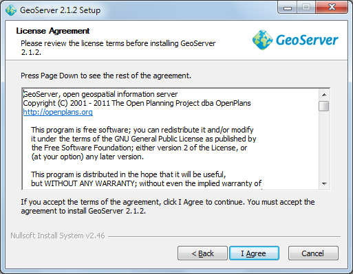
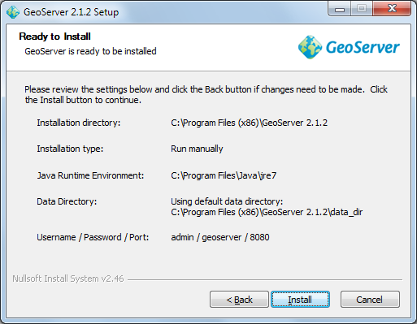

GeoServer Install
=================

GeoServer can be installed as a windows service or as an application. We will be testing our GeoServer as a normal application.

* Downloaded the latest GeoServer release:

  As this workbook went to press we got a hold of geoserver-2.1.2.exe

* Double-click the geoserver installer to start.
  |10000000000002010000018FD6A7E79C_png|

* G
  eoServer is released under the GPL license, press “I Agree” to contunue.
  |10000000000002010000018F72837274_png|

* GeoServer will install into the
  Programmers Files
  directory, press
  Next
  to continue.
  |10000000000002010000018F5E22EE7A_png|

* Press
  Next
  to create the default start menu folder
  |10000000000002010000018F8FD06244_png|

* GeoServer select your current Java Runtime Environment. Press Next to continue.
  |10000000000002010000018F59AC2A52_png|

* GeoServer will store your configuration in a “data directory”, the default location will work fine. Press
  Next
  to continue.
  |10000000000002010000018F59671AE4_png|

* GeoServer provides a web based configuration system allowing you to administer the application remotely. Please accept the default credentials (admin and geoserver) for the purpose of this tutorial.
  |10000000000002010000018F5D64B4D5_png|

* You can also choose the port for the service, 8080 will be fine for this tutorial.
  |10000000000002010000018FC0424ECF_png|

* We now get to choose “Run Manually” (as we are just interested in evaluating GeoServer at this time).
  |10000000000002010000018F66C9983F_png|

* You can review your settings and then press
  Finish
  to install GeoServer.
  |10000000000002010000018F6ED92A92_png|

* Please wait while GeoServer installs.
  |10000000000002010000018F9E8E423F_png|

* Thank you for installing GeoServer!

  |10000000000002010000018FC9C3F697_png|

.. |10000000000002010000018F5D64B4D5_png| image:: images/10000000000002010000018F5D64B4D5.png
    :width: 7.451cm
    :height: 5.791cm

.. |10000000000002010000018FC9C3F697_png| image:: images/10000000000002010000018FC9C3F697.png
    :width: 7.451cm
    :height: 5.791cm

.. |10000000000002010000018FC0424ECF_png| image:: images/10000000000002010000018FC0424ECF.png
    :width: 7.451cm
    :height: 5.791cm

.. |10000000000002010000018F5E22EE7A_png| image:: images/10000000000002010000018F5E22EE7A.png
    :width: 7.451cm
    :height: 5.791cm

.. |10000000000002010000018F66C9983F_png| image:: images/10000000000002010000018F66C9983F.png
    :width: 7.451cm
    :height: 5.791cm

.. |10000000000002010000018FD6A7E79C_png| image:: images/10000000000002010000018FD6A7E79C.png
    :width: 7.451cm
    :height: 5.791cm

.. |10000000000002010000018F8FD06244_png| image:: images/10000000000002010000018F8FD06244.png
    :width: 7.451cm
    :height: 5.791cm

.. |10000000000002010000018F59AC2A52_png| image:: images/10000000000002010000018F59AC2A52.png
    :width: 7.451cm
    :height: 5.791cm

.. |10000000000002010000018F59671AE4_png| image:: images/10000000000002010000018F59671AE4.png
    :width: 7.451cm
    :height: 5.791cm

.. |10000000000002010000018F9E8E423F_png| image:: images/10000000000002010000018F9E8E423F.png
    :width: 7.451cm
    :height: 5.791cm

