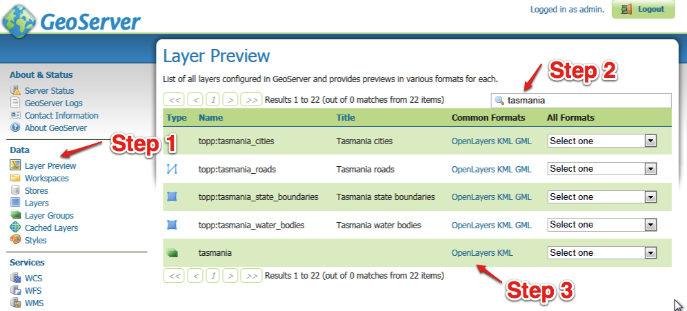

OpenLayers Tasmania Preview
===========================

GeoServer provides a layer preview implemented with the
OpenLayers
AJAX library.

* From the Welcome screen select
  Layer Preview
  from the list on the left
  .

* From the Layers Preview page type “
  Tasmania
  ” into the search box and press
  enter
  .

* In the
  tasmania
  row click on the “
  OpenLayers
  ” link.
  |10000000000003E4000001C3AF04C7C2_png|

* Click on the highlighted OpenLayers link at the bottom
  to open a new tab. As this Open Layers application is started up you can watch the GeoServer console respond to queries.
  |10000000000002A50000018649F451DE_png|

* This will bring up a web application put together with “Open Layers”.
  |100000000000020D000001EDF5529B51_png|

.. |100000000000020D000001EDF5529B51_png| image:: images/100000000000020D000001EDF5529B51.png
    :width: 10.16cm
    :height: 9.541cm

.. |10000000000002A50000018649F451DE_png| image:: images/10000000000002A50000018649F451DE.png
    :width: 11.46cm
    :height: 6.6cm

