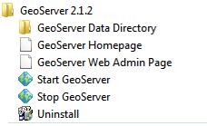

Starting up GeoServer
=====================

In this section you will learn how to start GeoServer, and explore its editing abilities.

* Click Start->Programs >GeoServer 2.0.1 >Start GeoServer
  |10000000000000E40000008B8FF2A8C8_png|

* When starting for the first time you will need to grant the Firewall permission for GeoServer to open a port.

  |100000000000021D0000018373C3F1BA_png|

* GeoServer will open up a console running the Jetty Application Server; please wait until
  Jetty indicates it is listening on port 8080 as shown below.
  |10000000000002A500000186248DC573_png|

* You can use the start menu to open the
  “GeoServer Web Admin Page”.
  The web browser will open:
  |10000000000003E3000001C42B919F62_png|

* We need to login before we can use the configuration screen. Fill in “admin” and “geoserver” along the top of the screen and press “Login”.

  |10000000000003E30000005E5EECAAB8_png|

* The welcome screen now has a great many more options than in previous versions.
  |10000000000003920000028E0917F97E_png|

* You may notice that this GeoServer belongs to “The ancient geographes INC”. Let us go in and fix that up.

* Click on
  Contact Information
  and fill in the details for your organisation.
  |100000000000035E0000028EE27AF6FB_png|

* Press the
  Submit
  button, you will be returned to the Welcome screen and you can see the contact organization has been changed.

* In a similar fashion change the title of the WMS to “Local Web Map Server”.
  |10000000000003E5000001C3577CBA2B_png|

.. |100000000000021D0000018373C3F1BA_png| image:: images/100000000000021D0000018373C3F1BA.png
    :width: 9.92cm
    :height: 7.1cm

.. |10000000000003920000028E0917F97E_png| image:: images/10000000000003920000028E0917F97E.png
    :width: 13.27cm
    :height: 9.49cm

.. |10000000000002A500000186248DC573_png| image:: images/10000000000002A500000186248DC573.png
    :width: 12.42cm
    :height: 6.271cm

.. |10000000000003E5000001C3577CBA2B_png| image:: images/10000000000003E5000001C3577CBA2B.png
    :width: 14.469cm
    :height: 6.549cm

.. |10000000000003E30000005E5EECAAB8_png| image:: images/10000000000003E30000005E5EECAAB8.png
    :width: 14.439cm
    :height: 1.36cm

.. |10000000000003E3000001C42B919F62_png| image:: images/10000000000003E3000001C42B919F62.png
    :width: 14.439cm
    :height: 6.56cm

.. |100000000000035E0000028EE27AF6FB_png| image:: images/100000000000035E0000028EE27AF6FB.png
    :width: 12.51cm
    :height: 9.49cm

