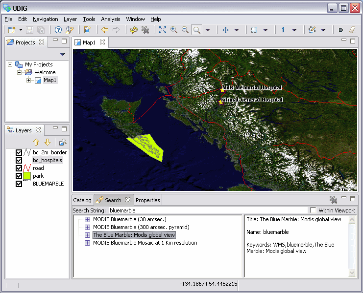

Editor
######

Most perspectives you work with are comprised of an editor area and one or more views.

Any number of editors can be open at once, but only one can be active at a time. The main menu bar
and toolbar for the Workbench window contain operations that are applicable to the active editor. Tabs
in the editor area indicate the names of resources that are currently open for editing. An asterisk (\*) 
indicates that an editor has unsaved changes.

By default, editors are stacked in the editor area, but you can choose to tile them in order to look
at content simultaneously.

Here is an example of a map editor in the Workbench:

**Related concepts**

.. toctree::
   :maxdepth: 1

   Workbench
   Projects view
   Catalog view
   Map editor
