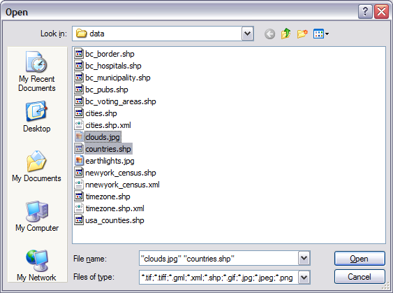
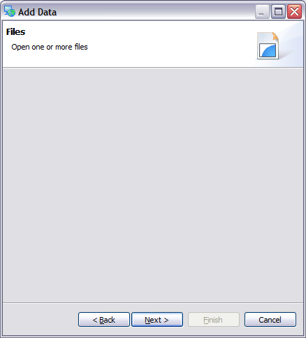

Files page
##########

The files page pops up a file dialog inviting you to open one or more files.

When using windows you can:

-  You can filter the list of files by type
-  Select multiple files by using the **control** key
-  Double click or press **Open** to proceed

File Formats
------------

The file open dialog can be used to choose between a range of spatial formats supported by udig.

+----------------------+---------------------------------------------+
| **Type**             | **Format**                                  |
+----------------------+---------------------------------------------+
| \*.tif, \*.tiff      | GeoTiff or Tiff with world file             |
+----------------------+---------------------------------------------+
| \*.gml, \*.xml       | An XML file format defined by the OGC       |
+----------------------+---------------------------------------------+
| \*.shp               | ESRI Shapefile format                       |
+----------------------+---------------------------------------------+
| \*.jpg, \*.jpeg      | JPEG image with world file                  |
+----------------------+---------------------------------------------+
| \*.png               | PNG image with world file                   |
+----------------------+---------------------------------------------+
| \*.\*                | Show all files                              |
+----------------------+---------------------------------------------+

Additional formats are available for installation in the help menu.

Known Problems
--------------

If you press **Cancel** from your File Open dialog you will be returned to the Files page:

The only thing to do directly from this page is to press **Cancel**, you can launch the Add Data
wizard to try again.

**Related concepts**

:doc:`Shapefile`
