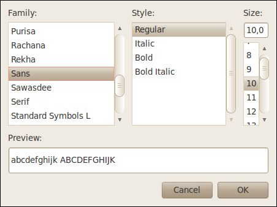

Font Selector dialog
####################

The font selector dialog is used to select or change font family, style and size.

Family
------

List of font families available for selection. Only single selection is allowed.

Style
-----

List of font styles in selected family. Only single selection is allowed.

Size
----

Font size can be entered manually or selected from list of predefined sizes.

OK button
---------

Closes the dialog and returns selected font.

Cancel button
-------------

Closes the dialog. Font is not changed.

Related reference
-------------------

* :doc:`Legend Decoration`
* :doc:`Graticule Decoration`
