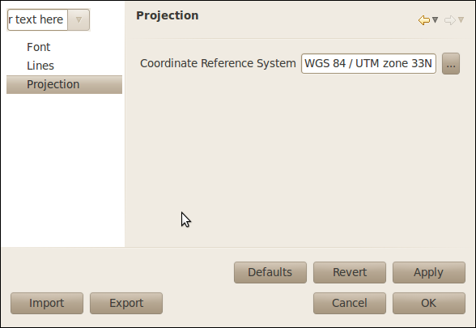

Graticule Decoration
####################

The graticule decoration displays a grapgraphic coordinate grid aligned with current map CRS.

.. figure:: images/graticule_decoration/graticule.png
   :align: center
   :alt: 

Style
-----

Graticule font can be styled.

Graticule lines can be styled.

   
Show different coordinate system grids
--------------------------------------

If you want to show different coordinate grids on top of each other, just add two graticules and change 
the projections from the *projection* paged in the style dialog.

which should produce something like this
   

**Related reference**

:doc:`Style Editor dialog`
