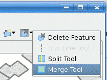

Merge Tool
----------

|image0| Merges geometries and attributes from various Features.

The *Merge Tool* works by selecting a set of features to be merged into one. It allows to set the
geometry and attributes of the merged Feature. The geometry could be either the **geometric union**
of the geometries from the input features, or the single geometry from one of the input features.

To use the Merge tool:
~~~~~~~~~~~~~~~~~~~~~~

#. Select the **Merge Tool** from the feature tool category in the tool bar.
    You can use the keyboard short cut **F** to cycle through the available feature tools
#. Draw a box covering one or more features
#. The **Feature Merge** view will display two columns:

   -  Sources: these are the features that are being combined; check off the attributes you wish to
      appear in the result
   -  Merge Feature: this is the resulting Geometry

#. For doing a Merge you will need 2 or more features.
#. You can continue selecting more features by drawing a box.
#. Press **Finish** to perform the operation
#. You can inspect your work in the :doc:`Map editor`
#. To save your work please press :menuselection:`Edit --> Commit` from the menu bar

.. image:: ../../../plugins/eu.udig.tools/nl/en/html/download/attachments/12276/Merge1.png
   :width: 60%

Behavior
~~~~~~~~

The *Merge Tool* operates upon the current Layer. Once the *Merge Tool* is selected, you can drag a
bounding box to select which Features to merge. A view will be opened so you can specify exactly
which attribute values from the input Features the *merged Feature* attributes shall assume the
values of.

It could be the case that the *geometric union* produces a geometry whose type is not compatible
with the allowable geometry type declared at the *Layer*'s *FeatureType*. For example, merging two
non touching *Polygons* on a polygon *Layer* would produce a *MultiPolygon*. In this case, assigning
the geometric union to the merged *Feature* geometry attribute will not be possible, but one of the
geometries from the source *Features* could be set through the *Merge View*.

When the *Merge Tool* proceeds to create the new, merged Feature, the ones it comes from will be
deleted at the same time.

Note that the *Merge Tool* does not commit the result, but lets you undo the operation if desired,
or commit the changes to the backend data repository as you would normally do in uDig.

.. note::
   **Coordinate Reference System**
   
   When the *Merge Tool* is instructed to create the new geometry as the union of the geometries from
   the input *Features*, the union is performed in the current *Layer*'s *Coordinate Reference System*.

Usage Example
~~~~~~~~~~~~~

Select the *Merge Tool* from the drop down buttons list as shown in *Figure 1*.

|image2|

 **Figure 1. Selecting the Merge Tool.**

Draw the *Bounding Box* to be used as the filter to select the *Feature* to be merged. At least two
*Features* need to be selected for doing a Merge, but the view will be opened if one feature is
selected.

|image3|

 **Figure 2. Selecting the Features to merge.**

Once you release the mouse button, the *features* matching the bounding box will be looked up and
the *Merge View* will show up.

*Figure 3* shows the *Merge View*, which consists of two panels.

The panel at the left is the *Source Features* panel and presents the selected *features*, their
attributes, and allows to select attribute values from source features to assign to the *Merge
Feature*.

The panel, at the right, is called the *Merge Feature* panel and presents the attributes of the
*feature* to be created as the result of setting its attributes through the *Source Features*.

When the *Merge View* is opened, the *Merge Feature* panel is populated with the attributes from the
first *Source* feature found (the one at the top on the *Source Features* panel). The geometry
attribute of the *Merge Feature* assumes the value of the geometric union of the geometries from the
source Features, and if that is not possible due to a type conflict with the Layer's *FeatureType*,
it assumes the value of the geometry from the first Feature.
 
|image4|

 **Figure 3. Merge View.**

While the *Merge View* is opened, the user can set specific attributes in the *Merge Feature* to
assume the values from other *Source Features* than the one at the top, by activating the checkbox
corresponding to the desired attribute on the desired *Source Feature*.

It is also possible to select the whole set of attribute of a single *Source Feature* by activating
the checkbox corresponding to the desired *Source Feature*.

*Figure 4* shows how two attributes, ``SOVEREIGN`` and ``COLOR_MAP`` have been assigned to the
*Merge Feature* from another *Source Feature* than the default one.

|image5|

 **Figure 4. Merge View with user specified attributes.**

Finally, when you're ready setting the geometric and non geometric attribute values for the *Merge
Feature*, press the *Finish* button on the *Merge View*.
The *Merge Tool* will create the new *Merge Feature* and delete the *Source Features* in a single,
undoable step.

The *Map* in *Figure 5* shows how the two buildings on this example have been merged into one, and
the *Table View* with the newly created *Feature*.

|image6|

 **Figure 5. Merge result**

Adding and deleting features.
^^^^^^^^^^^^^^^^^^^^^^^^^^^^^

For adding more features to be merged, select those features drawing a bounding box and they will be
added to the view.
For deleting features, select the feature to be deleted and click on the delete button or draw a
bounding box with Ctrl key pushed over the desired feature.

|image7|

 **Figure 6. Delete button**

.. |image0| image:: /images/merge_tool/merge_feature_mode.gif

.. |image3| image:: ../../../plugins/eu.udig.tools/nl/en/html/download/attachments/12276/merge_2_select_features.png
.. |image4| image:: ../../../plugins/eu.udig.tools/nl/en/html/download/attachments/12276/MergeDialog1.png
.. |image5| image:: ../../../plugins/eu.udig.tools/nl/en/html/download/attachments/12276/MergeDialog2.png
.. |image6| image:: ../../../plugins/eu.udig.tools/nl/en/html/download/attachments/12276/merge_5_merged_result.png
.. |image7| image:: ../../../plugins/eu.udig.tools/nl/en/html/download/attachments/12276/MergeDelete.png
