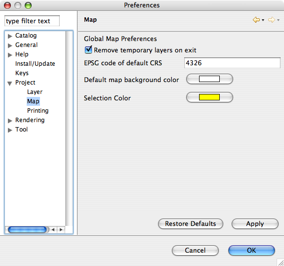

Project Preferences
===================

Project preferences and its children provides options for modifying the defaults and behavior of
creating projects and the elements that can be contained by projects.

.. _preferences-page-project-layer:

Layer Preferences
-----------------

Currently there are no layer level preferences that can be set. Future versions will provide options
that can be set for layers.

.. figure:: images/layer_preferences/layerpreferences.png
   :align: center
   :alt: 

   
Map Preferences
---------------

Map Preference page is used to supply system wide defaults for the Map Editor.



Remove Temporary Layers on exit
```````````````````````````````

When checked this option will remove temporary layers from the map. If it is not checked the layer
will stay in the map, but all data is lost since the layer is temporary. This option can be useful
if the FeatureType is complex and recreating the FeatureType can be time consuming.

Default is checked

EPSG code of default CRS
````````````````````````

Declares what the default CRS is, a value of -1 is used to indicate that the value should be
determiend from the data.

You may wish to change this setting when working with a large number of shapefiles that make use of
the same projection.

The default value is -1.

Default map background color
````````````````````````````

The color of the map's background.

Default is white.

Selection Color
```````````````

The color that selected feature will be drawn in.

Default is dark yellow.
   
   

Printing Preferences
--------------------

.. figure:: /images/printing_preferences/printingpreferences.png
   :align: center
   :alt: 

Available Preferences
`````````````````````

Default Template - Declares what page template should be used by default.
