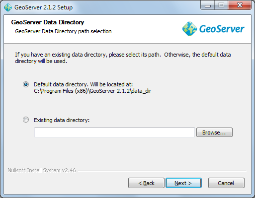
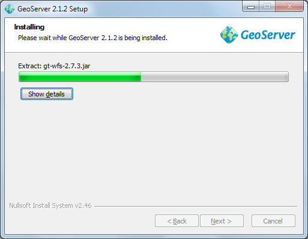
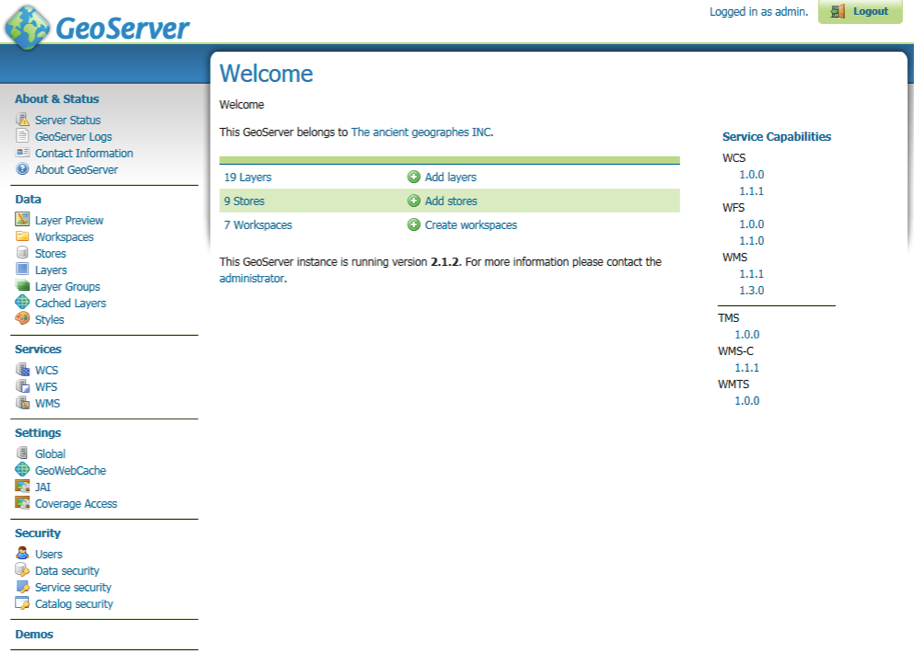

GeoServer Install
=================

|100002010000013E000000F87A9818C9_png|
|logo_refractions_png|
|10000201000000EA000000EA7E065A05_png|

|background_trees_png|

.. |logo_refractions_png| image:: images/logo_refractions.png
    :width: 2.799cm
    :height: 2.718cm

.. |100002010000013E000000F87A9818C9_png| image:: images/100002010000013E000000F87A9818C9.png
    :width: 2.69cm
    :height: 2.101cm

.. |background_trees_png| image:: images/background_trees.png
    :width: 21.026cm
    :height: 4.121cm

.. |10000201000000EA000000EA7E065A05_png| image:: images/10000201000000EA000000EA7E065A05.png
    :width: 4.055cm
    :height: 4.055cm

Introduction
------------

GeoServer is Java Enterprise Edition application used to publish spatial information. It supports a number of Industry Standard protocols and also offers a REST API for configuration.

In this workbook we are going to install GeoServer and go over a couple of configuration options.

After completing this workbook, you will have:

* Installed a Java Runtime Environment onto your computer

* Installed GeoServer using the Windows installer

* Started up and Customize GeoServer

* Started the Open Layers Tasmania Preview

Java Runtime Environment
------------------------

GeoServer is a Java application – if you do not already have Java on your system please go ahead and install it now. Any version of Java 5 or newer will do fine.

* Download the latest Java SE Runtime Environment from oracle:

  At the time of writing jre_7u1-windows-i586.exe had just been released.

* Double-click the installer (jre_7u1-windows-i586.exe is used in this example) and accept the license agreement.

  |100000000000020200000188E1DCF669_png|

* Press the Install but to get going.

  |10000000000002020000018860D0E3B4_png|

* Congratulations Java is now installed.

  |java_install_success_png|

.. |10000000000002020000018860D0E3B4_png| image:: images/10000000000002020000018860D0E3B4.png
    :width: 7.459cm
    :height: 5.69cm

.. |100000000000020200000188E1DCF669_png| image:: images/100000000000020200000188E1DCF669.png
    :width: 7.459cm
    :height: 5.69cm

.. |java_install_success_png| image:: images/java_install_success.png
    :width: 7.459cm
    :height: 5.69cm

GeoServer Install
-----------------

GeoServer can be installed as a windows service or as an application. We will be testing our
GeoServer as a normal application.

* Downloaded the latest GeoServer release:

  As this workbook went to press we got a hold of geoserver-2.1.2.exe

* Double-click the geoserver installer to start.
  
  |10000000000002010000018FD6A7E79C_png|

* G eoServer is released under the GPL license, press “I Agree” to contunue.

  |10000000000002010000018F72837274_png|

* GeoServer will install into the *Programmers Files* directory, press *Next* to continue.

  |10000000000002010000018F5E22EE7A_png|

* Press *Next* to create the default start menu folder

  |10000000000002010000018F8FD06244_png|

* GeoServer select your current Java Runtime Environment. Press Next to continue.

  |10000000000002010000018F59AC2A52_png|

* GeoServer will store your configuration in a “data directory”, the default location will work fine. Press *Next* to continue.

  |installer_data_dir_png|

* GeoServer provides a web based configuration system allowing you to administer the application remotely. Please accept the default credentials (admin and geoserver) for the purpose of this tutorial.

  |10000000000002010000018F5D64B4D5_png|

* You can also choose the port for the service, 8080 will be fine for this tutorial.

  |10000000000002010000018FC0424ECF_png|

* We now get to choose “Run Manually” (as we are just interested in evaluating GeoServer at this time).

  |10000000000002010000018F66C9983F_png|

* You can review your settings and then press *Finish* to install GeoServer.

  |10000000000002010000018F6ED92A92_png|

* Please wait while GeoServer installs.

  |10000000000002010000018F9E8E423F_png|

* Thank you for installing GeoServer!

  |10000000000002010000018FC9C3F697_png|

.. |10000000000002010000018F5D64B4D5_png| image:: images/10000000000002010000018F5D64B4D5.png
    :width: 7.451cm
    :height: 5.791cm

.. |10000000000002010000018F72837274_png| image:: images/10000000000002010000018F72837274.png
    :width: 7.451cm
    :height: 5.791cm

.. |10000000000002010000018FC9C3F697_png| image:: images/10000000000002010000018FC9C3F697.png
    :width: 7.451cm
    :height: 5.791cm

.. |10000000000002010000018FC0424ECF_png| image:: images/10000000000002010000018FC0424ECF.png
    :width: 7.451cm
    :height: 5.791cm

.. |10000000000002010000018F5E22EE7A_png| image:: images/10000000000002010000018F5E22EE7A.png
    :width: 7.451cm
    :height: 5.791cm

.. |10000000000002010000018F66C9983F_png| image:: images/10000000000002010000018F66C9983F.png
    :width: 7.451cm
    :height: 5.791cm

.. |10000000000002010000018FD6A7E79C_png| image:: images/10000000000002010000018FD6A7E79C.png
    :width: 7.451cm
    :height: 5.791cm

.. |10000000000002010000018F8FD06244_png| image:: images/10000000000002010000018F8FD06244.png
    :width: 7.451cm
    :height: 5.791cm

.. |10000000000002010000018F59AC2A52_png| image:: images/10000000000002010000018F59AC2A52.png
    :width: 7.451cm
    :height: 5.791cm

.. |10000000000002010000018F6ED92A92_png| image:: images/10000000000002010000018F6ED92A92.png
    :width: 7.451cm
    :height: 5.791cm

OpenLayers Tasmania Preview
---------------------------

GeoServer provides a layer preview implemented with the
OpenLayers
AJAX library.

* From the Welcome screen select *Layer Preview* from the list on the left.

* From the Layers Preview page type *Tasmania* into the search box and press enter.

* In the *tasmania* row click on the *OpenLayers* link.

  |10000000000003E4000001C3AF04C7C2_png|

* Click on the highlighted OpenLayers link at the bottom to open a new tab. As this Open Layers
  application is started up you can watch the GeoServer console respond to queries.
  
  |10000000000002A50000018649F451DE_png|

* This will bring up a web application put together with “Open Layers”.

  |100000000000020D000001EDF5529B51_png|

.. |100000000000020D000001EDF5529B51_png| image:: images/100000000000020D000001EDF5529B51.png
    :width: 10.16cm
    :height: 9.541cm

.. |10000000000002A50000018649F451DE_png| image:: images/10000000000002A50000018649F451DE.png
    :width: 11.46cm
    :height: 6.6cm

.. |10000000000003E4000001C3AF04C7C2_png| image:: images/10000000000003E4000001C3AF04C7C2.png
    :width: 14.46cm
    :height: 6.549cm

Starting up GeoServer
---------------------

In this section you will learn how to start GeoServer, and explore its editing abilities.

* Click Start->Programs >GeoServer 2.0.1 >Start GeoServer

  |start_geoserver_png|

* When starting for the first time you will need to grant the Firewall permission for GeoServer to open a port.

  |100000000000021D0000018373C3F1BA_png|

* GeoServer will open up a console running the Jetty Application Server; please wait until
  Jetty indicates it is listening on port 8080 as shown below.
  
  |10000000000002A500000186248DC573_png|

* You can use the start menu to open the
  “GeoServer Web Admin Page”.
  The web browser will open:
  
  |10000000000003E3000001C42B919F62_png|

* We need to login before we can use the configuration screen. Fill in “admin” and “geoserver” along the top of the screen and press “Login”.

  |10000000000003E30000005E5EECAAB8_png|

* The welcome screen now has a great many more options than in previous versions.

  |geoserver_welcome_admin_png|

* You may notice that this GeoServer belongs to “The ancient geographes INC”. Let us go in and fix that up.

* Click on *Contact Information* and fill in the details for your organisation.
  
  |100000000000035E0000028EE27AF6FB_png|

* Press the *Submit* button, you will be returned to the Welcome screen and you can see the contact organization has been changed.

* In a similar fashion change the title of the WMS to “Local Web Map Server”.

  |10000000000003E5000001C3577CBA2B_png|

.. |100000000000021D0000018373C3F1BA_png| image:: images/100000000000021D0000018373C3F1BA.png
    :width: 9.92cm
    :height: 7.1cm

.. |10000000000002A500000186248DC573_png| image:: images/10000000000002A500000186248DC573.png
    :width: 12.42cm
    :height: 6.271cm

.. |10000000000003E5000001C3577CBA2B_png| image:: images/10000000000003E5000001C3577CBA2B.png
    :width: 14.469cm
    :height: 6.549cm

.. |10000000000003E30000005E5EECAAB8_png| image:: images/10000000000003E30000005E5EECAAB8.png
    :width: 14.439cm
    :height: 1.36cm

.. |10000000000003E3000001C42B919F62_png| image:: images/10000000000003E3000001C42B919F62.png
    :width: 14.439cm
    :height: 6.56cm

.. |start_geoserver_png| image:: images/start_geoserver.png
    :width: 4.41cm
    :height: 2.69cm

.. |100000000000035E0000028EE27AF6FB_png| image:: images/100000000000035E0000028EE27AF6FB.png
    :width: 12.51cm
    :height: 9.49cm

What to do Next
---------------

If you finish early here are some challenges.

* The “Sample Requests” demo lets you try out requests one at a time by selecting them from a List
  and hitting Submit.
  
  * Try out a GetFeature request by hand.
  
  * Try out WMS GetCapabilities and confirm the title is as you defined it.

* Turn down the amount of logging to let GeoServer run faster

* Advanced: Have a look at the *open layers* link for the Tasmania layer preview. Can you explain
  what trick Geoserver is doing.
  
  Hint: Look at the URL and source code of the Tasmania layer preview.

* How can you use GeoServer in your organisation?
