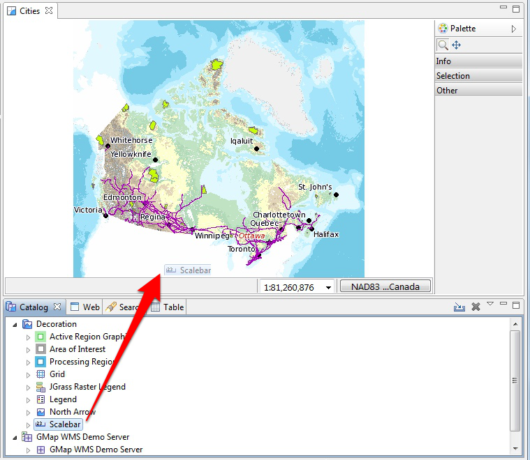

Adding Layers from the Catalog View
-----------------------------------

In this section you will learn how to add additional layers to your map from a previously connected data source (the DM Solutions WMS).

Adding a Layer from a previously connected WMS:

1. In the :guilabel:`Catalog` view expand the record for the
   :guilabel:`GMap WMS Demo Server` by clicking on the triangle beside the record.

2. Right-click on :guilabel:`Railroads` and select :guilabel:`Add to Current Map`.

   |10000000000002EF000000EB4154A6E9_png|

3. The new layer will appear in the :guilabel:`Layers` view and automatically start to render.
   
   |10000000000004000000030092D7F1D9_png|
   
   When it finishes rendering, you should see a new :guilabel:`Railroads` layer drawn on screen.

4. The catalog also comes equipped with a built in service called :guilabel:`Decoration`.
   
   Select :guilabel:`Decoration > Scalebar` in the :guilabel:`Catalog` view and drag this
   layer onto the Map
   
   |10000000000002F70000029466C467D3_png|

   The Scalebar is added to the top left corner of your map.

5. You can now close the Map Editor using the small :guilabel:`x` next to the map name.
  
6. Available maps including this one are shown in the :guilabel:`Projects` view if you
   would like to open your map again.

.. |10000000000002EF000000EB4154A6E9_png| image:: images/10000000000002EF000000EB4154A6E9.png
    :width: 12.719cm
    :height: 3.979cm

.. |10000000000004000000030092D7F1D9_png| image:: images/10000000000004000000030092D7F1D9.png
    :width: 14.861cm
    :height: 11.15cm

