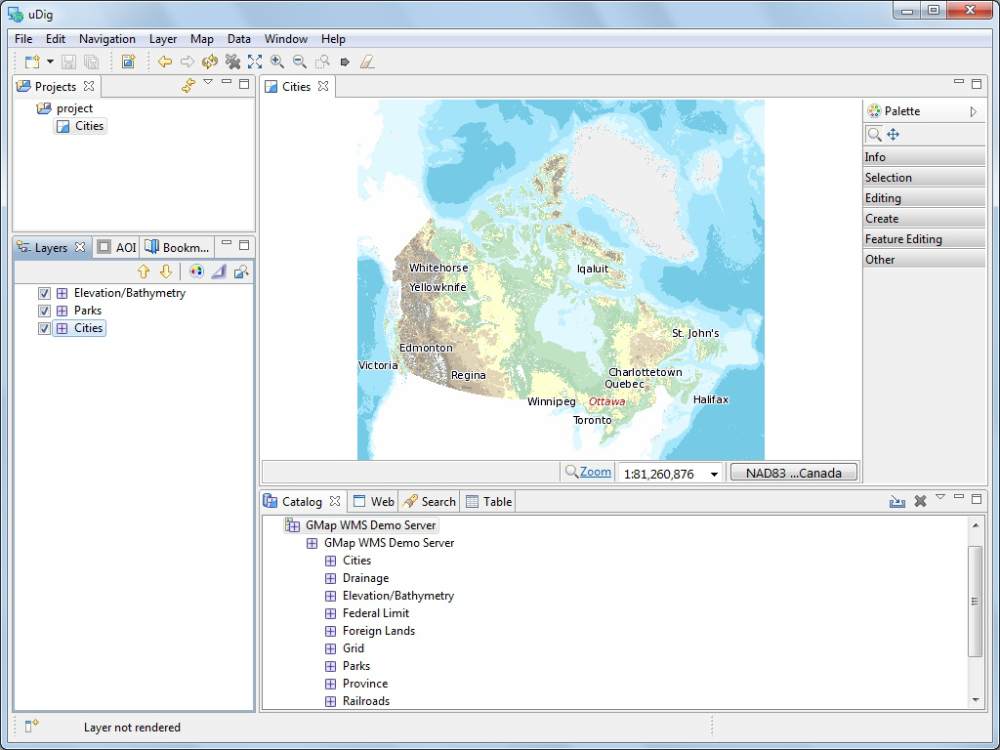
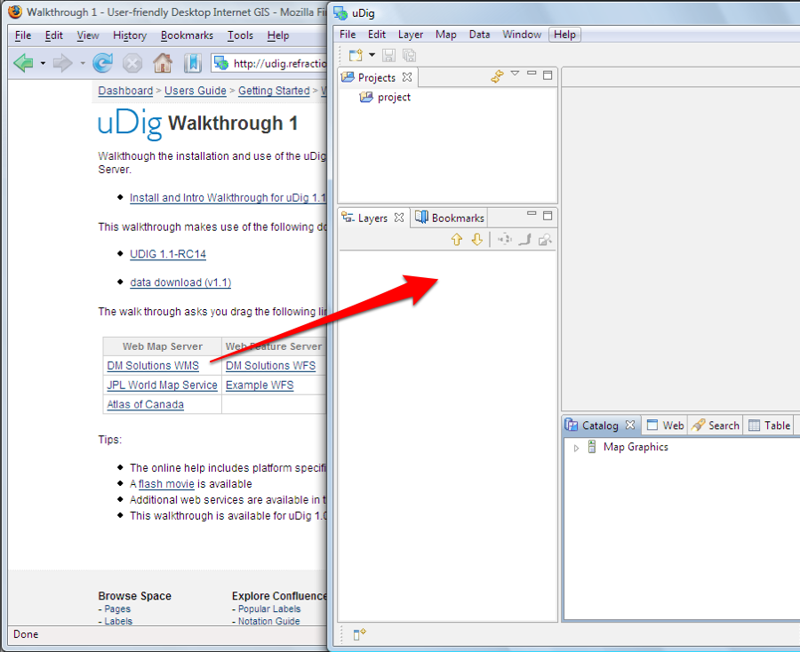
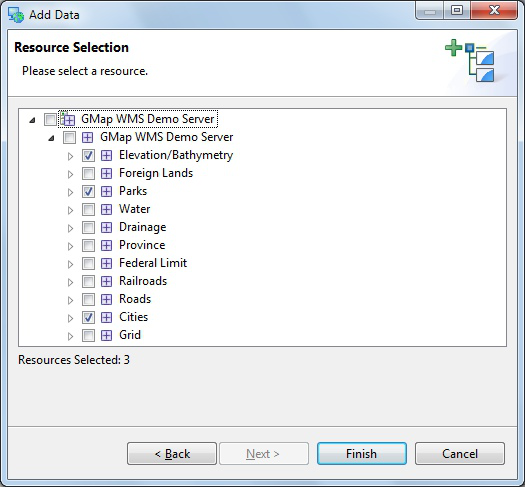

Connecting to a Web Map Server
------------------------------

In this section you will learn how to drag and drop a Web Map Server (WMS) link into uDig for the purpose of viewing its layers.

* There are many ways to load map data into uDig, including drag and drop.

* To demonstrate we will use the *DM Solutions WMS* Web Map Service. 
   
   The Web Map Service protocol is used to publish layers of information.
   
* We are going to use a link to the *GetCapabilities* document which lists the available layers: 
   `DM Solutions WMS <http://www2.dmsolutions.ca/cgi-bin/mswms_gmap?Service=WMS&VERSION=1.1.0&REQUEST=GetCapabilities>`_

   This link is also avaialble from the Walkthrough 1 page:
   :doc:`Walkthrough 1 <../../Walkthrough 1>`
      
* For most browsers you can simply drag the link into the :guilabel:`Layers` view
        
   |wms_dnd_png|

   * If your browser does not support dragging layers please :guilabel:`copy` the link and then select the
     :guilabel:`Layers` view and paste.
     
     The latest version of Internet Explorer and Opera do not support dragging URLs into other application.
   
   * If working with your windows maximized: Drag from the web browser, over to the uDig application
     in the task bar (to switch applications), and then drop into the :guilabel:`Layers` view.
   
  
* The :guilabel:`Add Layers` wizard will appear asking you what layers from this WMS you want to show in your map. Select
  :guilabel:`Elevation/Bathymetry, Parks, Cities` and press the :guilabel:`Finish` button.
  
   |wms_resource_selection_png|

* The map layers will now render in the :guilabel:`Map` editor.
   
   |wms_render_png|

Map Editor
----------

The :guilabel:`Map` editor is used to display a map on screen. You can open several Maps
and the :guilabel:`Layers` view will list the contents of the currently selected editor.

* The :guilabel:`Map` editor is used to display the visible layers.
   
   |wms_render_png|
   
* :guilabel:`Map` interaction is controled by the selected :guilabel:`Tool`
  in the :guilabel:`Palette` on the right hand side of the screen.
   
   Try the navigation tools along the top of the tool :guilabel:`Palette`.
   
   * |zoom_mode| Zoom (keyboard short cut :kbd:`z`)
     Click or drag the left button to zoom in, or right button to zoom out.
   
   * |pan_mode| Pan (keyboard short cut :kbd:`p`)
     Click and drag to move the display.
   
   Several shortcuts are always available:
   
   * **Mouse Wheel**: used to zoom in and out quickly
   
   * **Middle Button**: Used to quickly pan the display
   
* The :guilabel:`Palette` organises tools into drawers according to function.
   
   |palette_png|
   
   * You can open and close the drawers by clicking on their title.
   * Drawers will close automatically as you switch between drawers. Although you
     can also pin a drawer open for easy access.
   * Available tools change depending on the currently selected layer

* Right click on a drawer to customise the size of the icons used; and how much
  information is displayed in the :guilabel:`Palette`.
   
   |palette_large_png|

* The :guilabel:`Map` editor lists common commands in the :guilabel:`toolbar`
  along the top of the screen.
   
   * |zoom_extent_co| Extent: zoom out to show all enabled layers
   
   * |zoom_in_co| Zoom In
    
   * |zoom_out_co| Zoom Out
    
   * |cancel_all_co| Stop Rendering
    
   * |refresh_co| Refresh Map

* Press the |refresh_co| :guilabel:`Refresh` button, and watch the :guilabel:`processing` information
  displayed in the bottom right corner of the workbench.
   
   |map_editor_refresh_png|
   
   * Description and progress bar indicate rendering status
   * Button to open the :guilabel:`Progress` view providing more detail when
     several layers are rendering at once and the ability to cancel any long
     running activities.

* The :guilabel:`Layers` view shows the order in which layers are drawn. Please select the
  :guilabel:`Elevation/Bathymetry` layer and use the :guilabel:`Move down` button from the
  :guilabel:`Layer` view toolbar to move selected layer to the bottom of the list.
    
   |layers_down_png|

   **Drag and Drop** You can also drag layers up and down in the layer view to change the order.

* The order is now changed.
   
   |layers_down_moved_png|

* You can also use the checkboxes next to each Layer to turn them on and off.

.. |pan_mode| image:: /images/navigation_tools/pan_mode.gif

.. |zoom_mode| image:: /images/navigation_tools/zoom_mode.gif

.. |zoom_extent_co| image:: /images/navigation_tools/zoom_extent_co.gif

.. |zoom_in_co| image:: /images/navigation_tools/zoom_in_co.gif
    
.. |zoom_out_co| image:: /images/navigation_tools/zoom_out_co.gif
    
.. |cancel_all_co| image:: /images/navigation_tools/cancel_all_co.gif
    
.. |refresh_co| image:: /images/navigation_tools/refresh_co.gif

.. |palette_large_png| image:: images/palette_large.png
    :width: 1.891cm
    :height: 5.791cm

.. |palette_png| image:: images/palette.png
    :width: 1.87cm
    :height: 5.83cm

.. |map_editor_refresh_png| image:: images/map_editor_refresh.png
    :width: 14.861cm
    :height: 11.15cm

.. |layers_down_png| image:: images/layers_down.png
    :width: 5.911cm
    :height: 1.951cm

.. |layers_down_moved_png| image:: images/layers_down_moved.png
    :width: 5.911cm
    :height: 1.951cm

