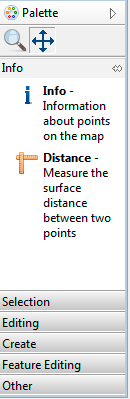
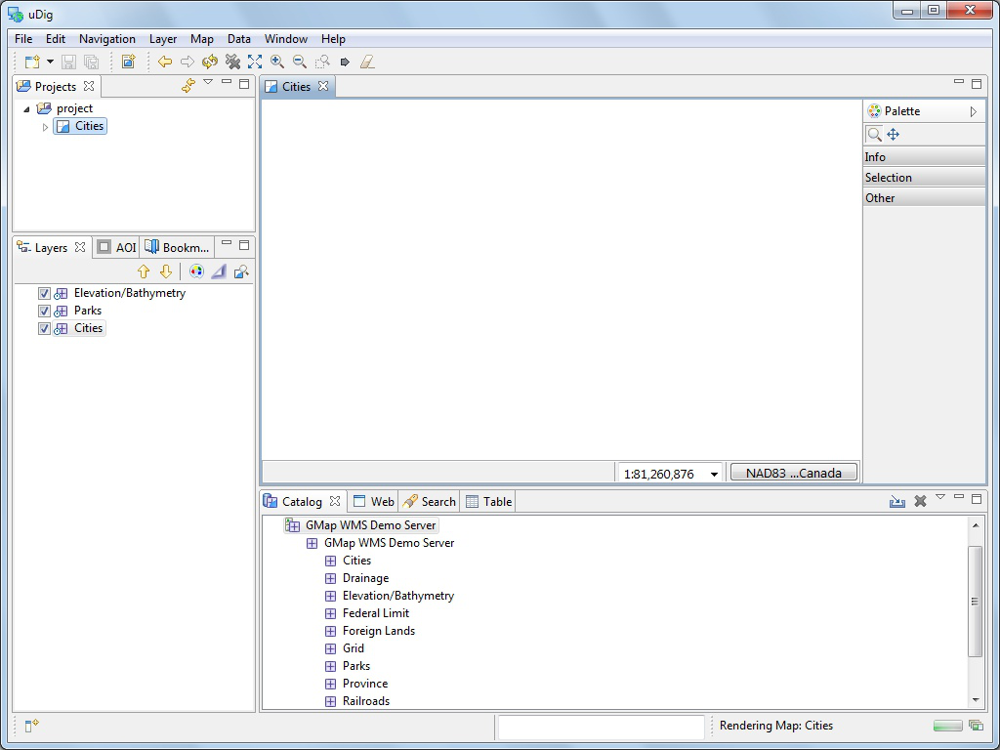
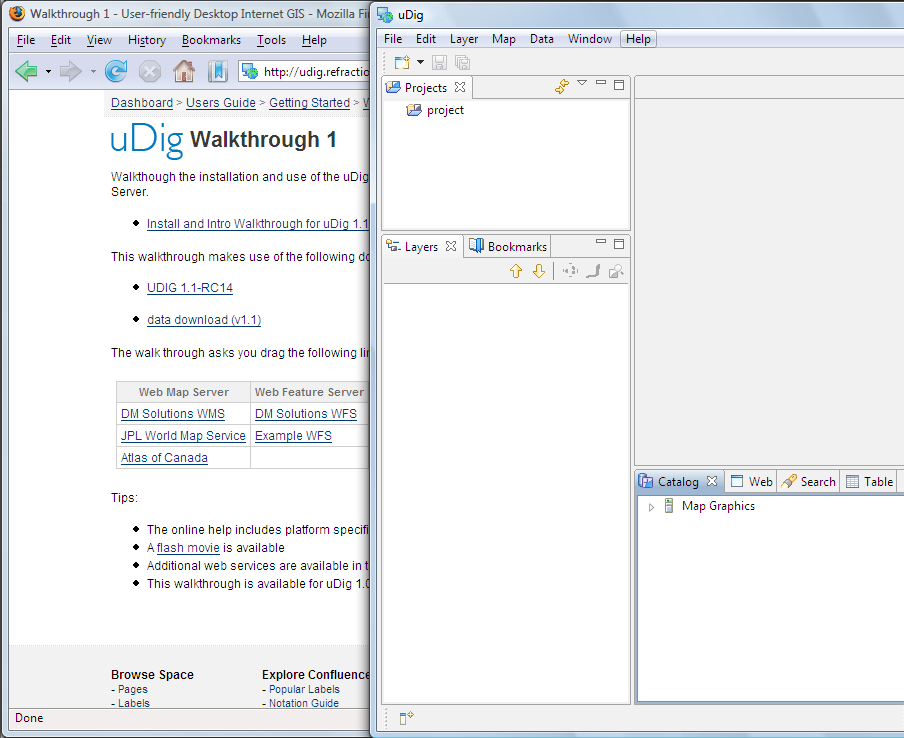

Connecting to a Web Map Server
-----------------------------------

In this section you will learn how to drag and drop a Web Map Server (WMS) link into uDig for the purpose of viewing its layers.

* There are many ways to load map data into uDig, including drag and drop.
  To drag a Web Map Server (WMS) link into uDig, open up a web browser.

* Please connect to the Walkthrough 1 page with your web browser:

* 

* We are going to use the
  DM Solutions WMS
  link as shown below:

* For most browsers you can simply drag the link into the
  Layes
  view

* If your browser does not support dragging layers please
  copy
  the link and then select the
  Layers
  view and
  paste.
  |1000000000000388000002E2E485918D_png|

* The
  Add Layers
  wizard will appear asking you what layers from this WMS you want to show in your map. Select
  Elevation/Bathymetry, Parks, Cities
  and press the
  Finish
  button.
  |100000000000020D000001E7638F1787_png|

* The map layers will now
  render
  in the Map view.
  Notice the bottom right corner of the uDig Application will display a
  processing notice
  while it is requesting and drawing the layers.
  |100000000000040000000300A11D76C3_png|

* When the layers are done rendering, the
  Map
  view will display the visible layers
  |10000000000004000000030027731BCF_png|

* Now that you have some data on screen try the navigation tools along the top of the tool palette.
  Zoom
  (keyboard short cut “
  z
  ”)
  Click or drag the left button to zoom in, or right button to zoom out.
  Pan
  (keyboard short cut “
  p”
  )
  Click and drag to move the display.

* The remaining tools are organised into drawers according to function.
  You can open and close the drawers by clicking on their title. Drawers will close automatically as you switch between drawers. You can also pin a drawer open for easy access.
  |1000000000000081000001924E854422_png|

* You can right click on a drawer to customise the size of the icons used; and how much information you wish to see in the palette.
  |10000000000000820000018F9C5F08A7_png|

* In addition to the palette the map has a toolbar along the top of the screen.
  |100002000000001000000010BAAA234E_png|

  Extent:
  Press to show all layers enabled in the Layers View

* The
  Layers
  view shows the order in which layers are drawn. Please select the
  Elevation/Bathymetry
  layer and use the
  Move down
  button from the Layer view toolbar to move this to the bottom of the list.
  |100000000000015D00000073FDB25240_png|

* The order is now changed.
  |100000000000015D00000073252C5C23_png|

.. |1000000000000081000001924E854422_png| image:: images/1000000000000081000001924E854422.png
    :width: 1.87cm
    :height: 5.83cm

.. |10000000000004000000030027731BCF_png| image:: images/10000000000004000000030027731BCF.png
    :width: 14.861cm
    :height: 11.15cm

.. |100000000000015D00000073FDB25240_png| image:: images/100000000000015D00000073FDB25240.png
    :width: 5.911cm
    :height: 1.951cm

.. |100002000000001000000010BAAA234E_png| image:: images/100002000000001000000010BAAA234E.png
    :width: 0.423cm
    :height: 0.423cm

.. |100000000000015D00000073252C5C23_png| image:: images/100000000000015D00000073252C5C23.png
    :width: 5.911cm
    :height: 1.951cm

.. |100000000000020D000001E7638F1787_png| image:: images/100000000000020D000001E7638F1787.png
    :width: 8.89cm
    :height: 8.25cm

