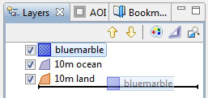
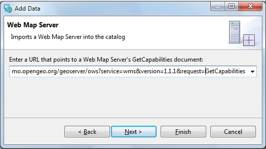
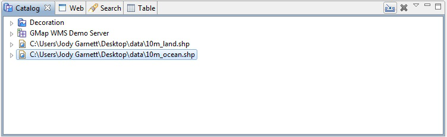
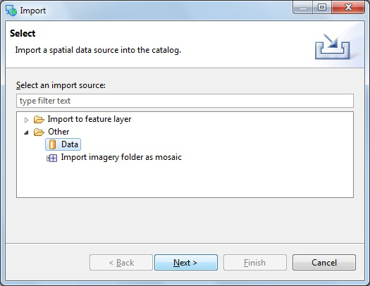

Import Directly to The Catalog
------------------------------

Earlier we learned how to work with content from the Catalog view, in this section we will import content directly into the catalog.

1. On the :guilabel:`Catalog` view please press the :guilabel:`Import` button:
   
   |catalog_ocean_png|
   
2. Select :guilabel:`Other > Data` and press :guilabel:`Next`.
   
   |import_data_png|

3. Choose :guilabel:`Web Map Server` from the list and press :guilabel:`Next`.
   
   |imort_wms_png|

4. This time we are going to import an OpenGeo demo Web Map Server using the following Capabilities document:

   * http://demo.opengeo.org/geoserver/ows?service=wms&version=1.1.1&request=GetCapabilities

   You can copy and paste the above URL into the provided field:

   |wms_wizard_png|

5. Press :guilabel:`Finish` to import the Web Map Server into the :guilabel:`Catalog` view.
   
6. Now that we have imported the WMS into the catalog we can add it to our Map.

7. Drag and Drop the :guilabel:`bluemarble` layer directly onto :guilabel:`Map` editor.
   
   |catalog_dnd_map_png|

8. Earlier we used the the layer view to reorder using the up and down buttons,
   this time we will drag the layers into the right order.

9. Select the :guilabel:`Blue Marble` layer in the layer view and drag it to the bottom of the list.
   
   |layers_dnd_png|

.. |catalog_dnd_map_png| image:: images/catalog_dnd_map.png
    :width: 14.87cm
    :height: 11.24cm

.. |imort_wms_png| image:: images/imort_wms.png
    :width: 7.62cm
    :height: 7.47cm

