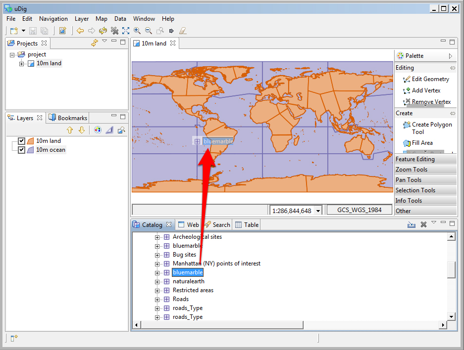

Import Directly to The Catalog
-----------------------------------

Earlier we learned how to work with content from the Catalog view, in this section we will import content directly into the catalog.

* On the
  Catalog View
  please press the Import button:
  |10000000000002F0000000E7DC81AE6C_png|

* Select
  Other >
  Data
  and press
  Next
  .
  |100000000000020D000001965AB3110A_png|

* Please choose
  Web Map Server
  from the list and press
  Next
  .
  |100000000000020D000002034717BE22_png|

* This time we are going to import an OpenGeo demo Web Map Server using the following Capabilities document:

* 

* You can copy and paste the URL into the provided field:
  |100000000000020D000001274D6A1AB8_png|

* Press
  Finish
  to import the Web Map Server into the Catalog view.

* Now that we have imported the WMS into the catalog we can add it to our Map. Please Drag and Drop the
  bluemarble
  layer directly onto
  Map
  |10000000000003A9000002C44034F690_png|

* Earlier we used the the layer view to reorder using the up and down buttons, this time we will drag the layers into the right order. Select the
  Blue Marble
  layer in the layer view and drag it to the bottom of the list.
  |10000000000001010000007AC9F16190_png|

.. |10000000000001010000007AC9F16190_png| image:: images/10000000000001010000007AC9F16190.png
    :width: 3.731cm
    :height: 1.769cm

.. |100000000000020D000001274D6A1AB8_png| image:: images/100000000000020D000001274D6A1AB8.png
    :width: 9.721cm
    :height: 5.459cm

.. |100000000000020D000002034717BE22_png| image:: images/100000000000020D000002034717BE22.png
    :width: 7.62cm
    :height: 7.47cm

.. |10000000000002F0000000E7DC81AE6C_png| image:: images/10000000000002F0000000E7DC81AE6C.png
    :width: 10.91cm
    :height: 3.35cm

.. |100000000000020D000001965AB3110A_png| image:: images/100000000000020D000001965AB3110A.png
    :width: 7.62cm
    :height: 5.89cm

