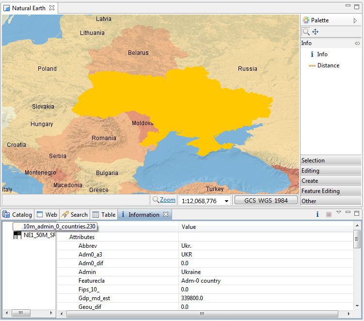

Information Request
-----------------------------------

In this section, you will learn how to use the Information Tool.

* Let us open up our first map again, which was labeled
  Cities
  |100000000000012E000000FEE45169D4_png|

* Let’s
  zoom
  to somewhere interesting, such as a green park.

* Change to the
  Info Tool (I)
  in the tool palette.

* Click on a green park; and we can ask the WMS for more information.
  |10000000000002E60000028ED379F49B_jpg|

* The
  Information
  view is opened; showing information about the park layer at the location you clicked.

* Not all Web Map Servers support the “GetFeatureInfo” operation; as such information may not be available for all layers. The application uses a normal browser to display HTML content; you can drag the view out of the workbench if you find you need more elbowroom.

* Open your
  Natural Earth
  map and we can try the
  Info
  tool on feature and raster data.
  Use the
  Info
  tool to click on a country; and then select
  10m admin 0 countries
  in the
  Information
  view. You will see the information view flash the country to remind you of the area you clicked.
  |10000000000002EF000002964327B9F6_png|

* You can use the
  Information
  view to explore the attributes of the country you clicked on however you cannot change the values here (we will cover editing in Walkthrough 2).

* You can switch to requesting information on another layer on the
  left pane
  . Available information, if any, is displayed on the
  right pane
  .
  Try this by changing to the raster layer
  NE1_50M_SR_W
  .
  |10000000000002EF000000E97376715B_png|

.. |100000000000012E000000FEE45169D4_png| image:: images/100000000000012E000000FEE45169D4.png
    :width: 4.38cm
    :height: 3.679cm

.. |10000000000002E60000028ED379F49B_jpg| image:: images/10000000000002E60000028ED379F49B.jpg
    :width: 10.77cm
    :height: 9.49cm

.. |10000000000002EF000000E97376715B_png| image:: images/10000000000002EF000000E97376715B.png
    :width: 10.901cm
    :height: 3.38cm

