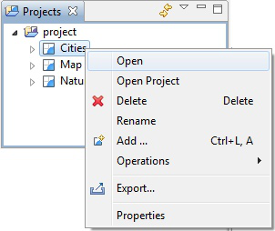
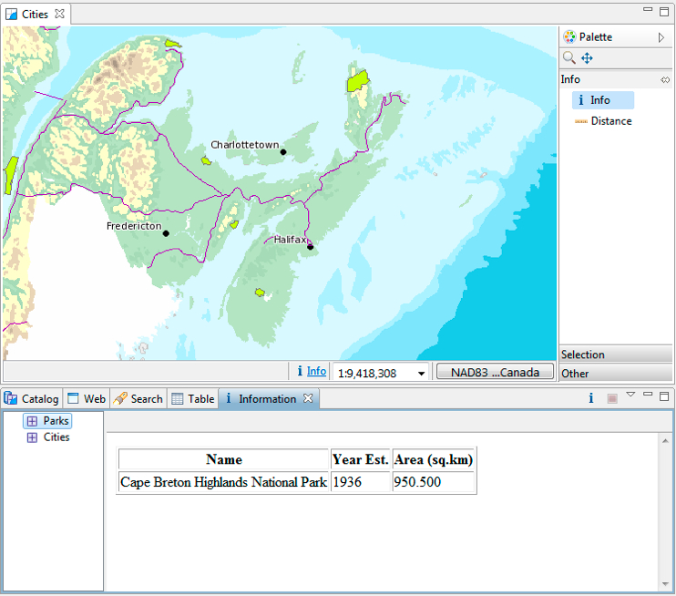
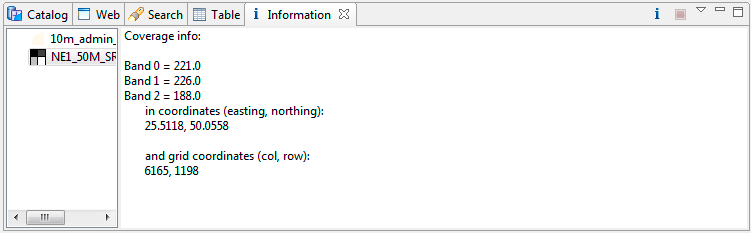

Information Request
--------------------

In this section, you will learn how to use the :guilabel:`Info` tool.

1. Open up our first map labeled :guilabel:`Cities`.
   
   |projects_open_png|

   * You can also double click on the :guilabel:`Cities` map in the :guilabel:`Projects`
     view to open it.

2. Use the :guilabel:`Zoom` tool to navigate to an interesting detail, such as a green park.

3. Change to the :guilabel:`&Info` tool in the :guilabel:`Map` editor :guilabel:`palette`.
   
   * You can use the :kbd:`i` keyboard shortcut cycle between available information tools.
     
     The tool cursor to indicate the current tool so you do not have to look up when
     working.
   
4. Click on a green park; to request more information from the Web Map Service.
   
   |setup_loading_jpg|

5. The :guilabel:`Information` view is opened, listing details about the :guilabel:`Park`
   layer at the location specified.
   
   * Not all Web Map Servers support the *GetFeatureInfo* operation;
     as such information may not be available for all layers.
   * The application uses a normal browser to display HTML content
   * If a lot of information is returned you may wish to drag the
     :guilabel:`Information` view out of the workbench to have
     more reading space.

Feature and Raster Values
^^^^^^^^^^^^^^^^^^^^^^^^^

You can also use the :guilabel:`Information` view to quickly review feature and raster values.

1. Open your :guilabel:`Natural Earth`, and use the :guilabel:`Info`tool to click on
   a country.
   
   The :guilabel:`Information` view open to list each layer with information
   
2. The left pane of the :guilabel:`Information` used to pick the details to display.
   
   Pick the :guilabel:`10m admin 0 countries` feature listed.

3. The right pane of the :guilabel:`Information` view is used to explore the attributes of
   the country you clicked on. 
   
   |info_feature_png|
   
   * You will see the information view flash the country to remind you of the area
     you clicked. This is useful when sorting through several featuers on different
     layers.

   * The :guilabel:`Infromation` view is only used review values, we will cover
     editing as part of :doc:`/getting_started/walkthrough2/index`

4. The details displayed based on the content picked in the left pane of the
   :guilabel:`Information` view.
   
   Pick the :guilabel:`NE1_50M_SR_W` raster layer to review the RGB values.
   
   |info_raster_png|

.. |info_feature_png| image:: images/info_feature.png
    :width: 10.901cm
    :height: 9.61cm

