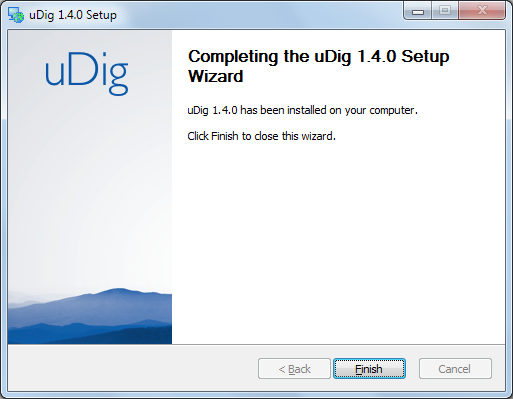
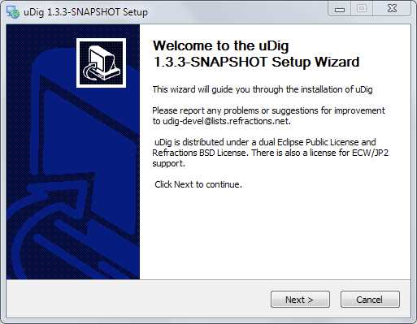
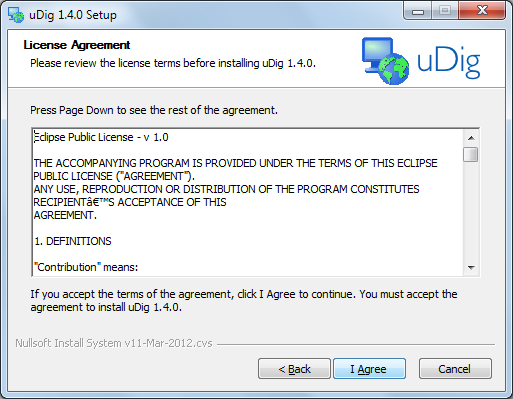
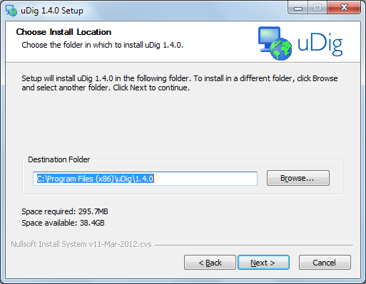
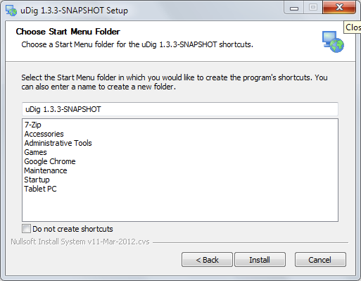
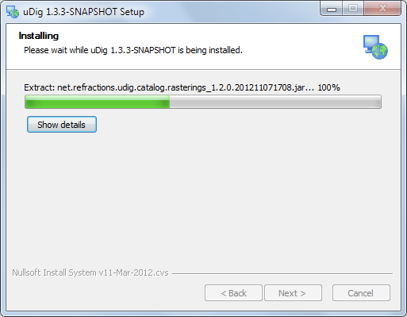

Installing and Running The uDig Application
-------------------------------------------
   
In this section, you will install and run the Eclipse Application, which will be used for viewing map information.

Windows install:

1. Double-click the installer.
   
   |setup_loading_jpg|

.. sidebar:
   
   If you are in a  workshop your instructor has included the uDig installer DVD or flash drive.

2. The installer will allow you to install uDig into the directory of your choice.

   |installer_welcome_png|

.. sidebar:
   
   uDig is released with a business friendly LGPL license.
   
   ECW/JP2 support is freely available to desktop applications.

3. We have a number of license agreements to click through.

   |installer_license_png|

4. By default uDig will be installed into your Program Files directory.
 
   |installer_location_png|

5. Shortcuts will be created in your start menu.

   |installer_start_menu_png|

6. Please wait while uDig is installed.

   |installer_installing_png|

7. Congratulations you have installed uDig!

   |installer_finish_png|

   We have a known issue telling Windows 7 that the installation was successful. Please click “This program installed correctly”.

   |installer_warning_png|

8. If you are working in a corporate environment with a firewall please review the following page for details on proxy configuration.

   :doc:`/Running uDig`

.. |setup_loading_jpg| image:: images/setup_loading.jpg
    :width: 5.44cm
    :height: 1.57cm

.. |installer_warning_png| image:: images/installer_warning.png
    :width: 7.999cm
    :height: 6.541cm

