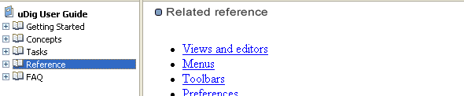
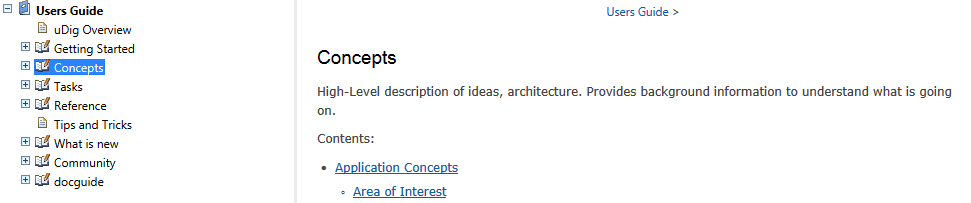
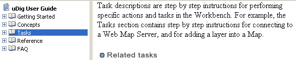
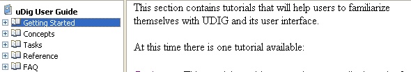
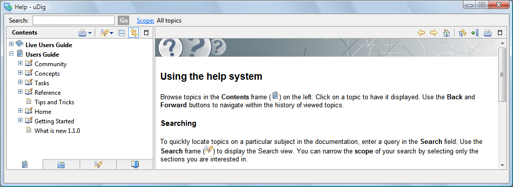

Online Documentation and Tutorials
----------------------------------

In this section you will open up the online tutorial, and access reference information.

.. hint::
   You can access the tutorials directly by pressing :guilabel:`Getting Started` on the welcome screen.
   
* Open up the :guilabel:`Help` menu and select :guilabel:`Help Contents`
 
   |menubar_help_contents_png|

* The windows firewall will need to allow the help application to startup.
  
   |help_firewall_png|

* This will bring up the online help system; the help system is a web application that makes use of a :guilabel:`Contents`
  view to allow you to navigate between :guilabel:`Pages`.
   
   |help_system_png|
   
   * |help_contents_png| Show in Table of Contents find your place in the table of contents.

* The :guilabel:`Contents` view organizes :guilabel:`Pages` into :guilabel:`Books`.
   
   The following books are included with the uDig application:
   
   * User Guide
   * Live User Guide - direct access to uDig web site
   
   More book may be included when you install additional features.
  
Help Categories
^^^^^^^^^^^^^^^

You can access additional reference information in the following categories:

* Getting Started

  |help_getting_started_png|

* Concepts

  |help_concepts_png|

* Tasks

  |help_tasks_png|

* Reference

  |help_reference_png|

