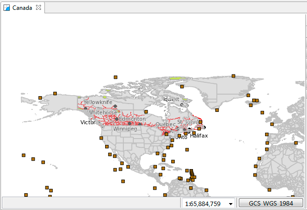
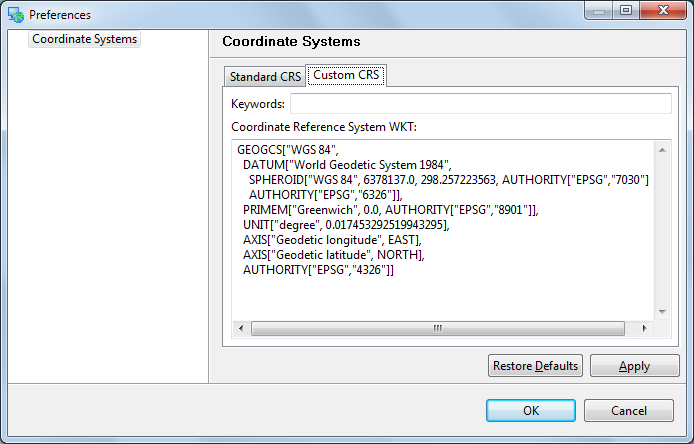
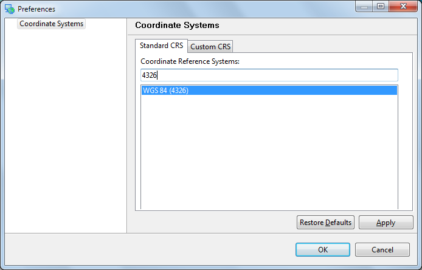

Re-projection
-------------

The shapes making up a map can come from a range of coordinate reference systems - each using different measurements
to record locations on the earth. 

In order to combine these data sets on screen automatic reprojection is used to transform information
into the common coordinate reference system you have selected for your map.

* Open your :guilabel:`Canada` map from the previous section.

* Add some additional shape files to the map from your data directory.
  
  * :guilabel:`10m_admin_1_states_provinces.shp`
  * :guilabel:`10m_geography_regions_points.shp`

* The resulting map is taking information from a variety of different sources
  and re-projecting the data into a single display.
  
  |reproject_nad83_png|

* You can ask that the map change its projection to match a layer.

  Right click on :guilabel:`10m admin 1 states provinces` and use
  :menuselection:`Operation --> Set Map Projection from Layer`
  to use this layers projection.
  
  |reproject_wgs84_png|
  
  * Not all coordinate reference systems can display all information. Some
    are only valid for a specific region.
    
    This operation can be useful if you are having any trouble displaying
    a layer and want to directly view the data.

* You can also choose the map coordinate reference system yourself.
  
  In the :guilabel:`Map` editor status area pess the :guilabel:`GCS_WGS_1984` button
  to bring up the :guilabel:`Coordinate Systems` property page for your map.
  
* The :guilabel:`Coordinate Systems` property page allows you to change the Coordinate Reference
  System of your map. The :guilabel:`Standard CRS` tab allows you to search the predefined coordinate reference systems.
  
  Please type in :kbd:`4326` and press :kbd:`enter`.
  
  |crs_standard_png|
  
  * This selects the :guilabel:`World Geodetic System 1984` which is commonly
    used to represent lat/lon information.
  
  * You can also search by name, try typing in :kbd:`WGS84` to list matching projections

* You can have a look at the formal definition of :guilabel:`EPSG:4326` by
  switching to the :guilabel:`Custom CRS` tab.
  
  |crs_custom_png|
  
  * The definition is provided in *Well Known Text* - you can use this format for your own custom CRS.

* Press the :guilabel:`OK` button to change the coordinate reference system of your map.

.. |reproject_nad83_png| image:: images/reproject_nad83.png
   :width: 8.999cm
   :height: 6.181cm

