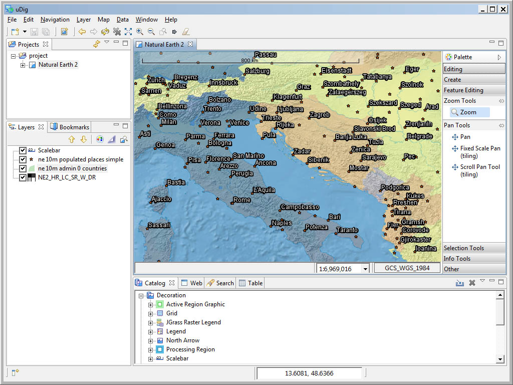

The Workbench
-----------------------------------

Before we start playing with maps, let’s take a look at the default layout of the uDig workbench and what some of the key components are.

Shown below is a typical session of uDig with the Map, Projects, Layers, and Catalog views labeled.
These views will be described further as we demonstrate their uses.

|10000000000004000000030096788289_png|

