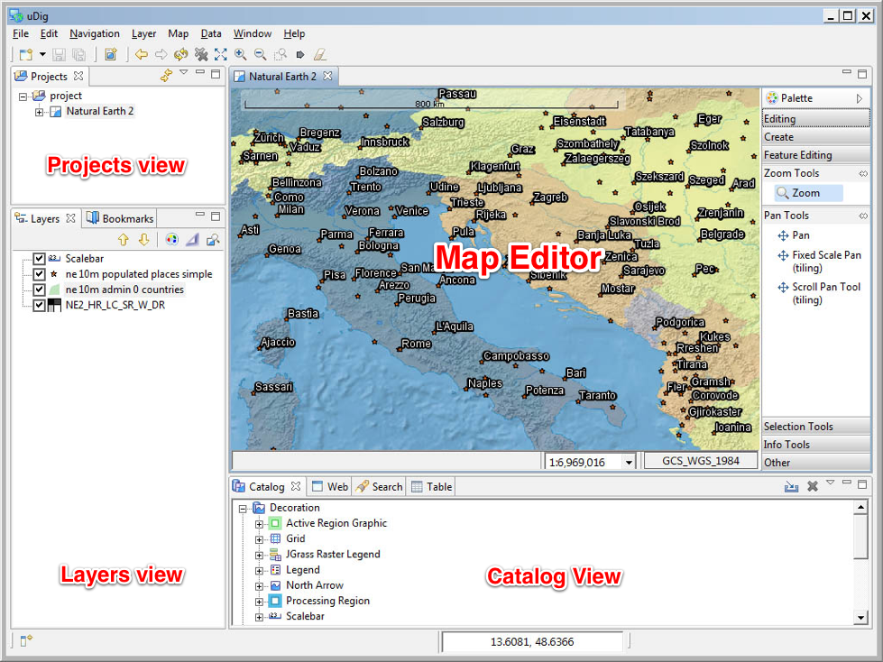

The Workbench
-----------------------------------

Before we start playing with maps, let's take a look at the default layout of the uDig workbench and what some
of the key components are.

Shown below is a typical session of uDig with an open :guilabel:`Map` editor surrounded by :guilabel:`Projects`,
:guilabel:`Layers`, and :guilabel:`Catalog` views. These views will be described further as we demonstrate their uses.

|workbench_png|

