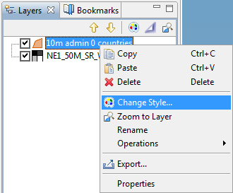

Style Editor
------------

The :guilabel:`Style Editor` allows fine grain control of the layer rendering.
In addition to shapes, layers contain attribute values which we can use to
control the rendering process.

In this section we will create a *Styled Layer Descriptor* (SLD) file with
the uDig :guilabel:`Style Editor` in order to generate labels and theme
by attribute values.

1. Create a new map using :guilabel:`File > New > New Map`

2. Select your new map in the :guilabel:`Projects` view, and right click to choose
  :guilabel:`Rename`.
  
  |100000000000012600000100A3BFB98C_jpg|

3. Enter the name :kbd:`Natural Earth` and press :guilabel:`OK`.

4. In the :guilabel:`Layer` menu, select :guilabel:`Add`

5. Choose :guilabel:`Files` from the provided list and press :guilabel:`Next`.
 
   |100000000000020D00000203728201CC_png|

7. Select the following files from your data directory:

   * :guilabel:`10m_admin_0_countries.shp`
   * :guilabel:`NE1_50M_SR_W.tif`
   
   On windows hold down the control key to selecting multiple files.
   
   |1000000000000280000002075AA28808_png|

8. Press :guilabel:`Open` and both layers will be added to your map and
   rendered with a default style.
   
   * The default style for the :guilabel:`10m admin 0 countries` layer is
     slightly transparent so can see the base raster layer.
   * You may wish to zoom out using the toolbar :guilabel:`Zoom Extent` command

10. Right click on the countries layer and select :guilabel:`Change Style`
    to open the :guilabel:`Style Editor`.
    
    |100000000000014A00000111DE88E6CF_png|

11. The :guilabel:`Style Editor` is arranged into a series of pages.
    
12. Select the :guilabel:`Polygons` page from the list on the right.
    
    We will use this page to add labels to the countries layer.
    
13. Click the :guilabel:`Labels` tab on the :guilabel:`Polygon` page.

    * Enable labels by checking the :guilabel:`enable/disable labelling` checkbox
    * In the list to the far right of :guilabel:`label` choose the :guilabel:`NAME` attribute
    
    |10000000000003F5000002C307148CF1_png|
    
14. You can press the :guilabel:`Apply` button to see what your map will look like with labels

Theme
^^^^^

A common use for maps is as a visual display of attribute values. In cartographic
terms this is known as creating a *Thematic* map, accomplished by defining
a *theme* for a layer.

The :guilabel:`Style Editor` is used to theme data by setting up a thematic style
for a layer based on attribute values.

1. Please switch to the :guilabel:`Theme` page and select the following:
   
   * :guilabel:`Attribute`: Select the :guilabel:`POP_EST` attribute.
   * :guilabel:`Normalize`: Select the :guilabel:`GDP_MD_EST` attribute.

   |10000000000002E6000001D0C3BF163B_png|
    
2. Filter the available colour palettes to show a subset of those available:
   
   * :guilabel:`Show`: Change from guilabel:`Show All` to :guilabel:`Sequential`
   * Press the :guilabel:`Colour-blind`, :guilabel:`LCD` and :guilabel:`CRT` buttons
   * Select the :guilabel:`light orange to dark red` color palette
   
   |10000000000002E20000025740AFFEC9_png|
   
   These options show palettes which are a ramp of color suitable for viewing by color
   blind people on either an LCD or CRT monitor.

3. Press the :guilabel:`OK` button
   
   |10000000000002F5000001A9713A4194_png|

4. The countries layer is now displayed as theme of population data normalized by gross domestic
   product as a quick measure of population productivity.

Legend
^^^^^^

You can use a legend to review the colours and symbology used to illustrate your themaitic map.
 
1. From the menubar select :guilabel:`Layer > Legend`.
    
    |1000000000000166000000D890C47BCC_png|
    
2. The :guilabel:`Legend` decorator offers a quick summary of your themed data.

Mylar
^^^^^

The map display can become very complicated depending on the level of detail being displayed.

The Mylar functionality is used to focus on the selected layer.

1. Press the :guilabel:`Mylar` button in the :guilabel:`Layers` view toolbar.
    
2. Select each layer and observe the effect.
   
   |1000000000000402000002FE20171B5A_png|
    
3. The Mylar effect is used to focus on the selected layer by fading out everything else.

Layout and Perspectives
-----------------------

1. :guilabel:`Map` editors can be resized and expanded

   * Double click on the :guilabel:`Natural Earth` editor tab to maximize the editor display.
     
   * Use using the zoom tool to explore the world while the editor is maximized.
   
   |100000000000040000000300208450BB_png|

   * Your :guilabel:`Layer` view is still available as a fast view the left hand side of the screen.
     Press :guilabel:`Layer` view button to slide the :guilabel:`layer` view on and off the screen as needed.

   * Double click on the :guilabel:`Natural Earth` editor tab again to restore the previous size.
   
2. You can also open two map editors and arrange them side by side by dragging
   the :guilabel:`Map` editor tab into position.

3. You have a lot of flexibility in arranging views around your :guilabel:`Map` editor.
   
   * You can drag views into different locations along the edge of your map by dragging their
     :guilabel:`View` tab into the desired location.
   * You can detach a view by dragging it completely out of the window
   * You can right click on the view for more options including a slide out :guilabel:`Fast` view.
   * More views are available using the menubar :guilabel:`Window > Show Views`

4. The arrangement of the :guilabel:`Workbench` editors and views is called a :guilabel:`Perspective`.
   
   * Switch between perspectives using the menubar :guilabel:`Window > Open Perspective`
   * Use the menubar :guilabel:`Window > Reset Perspective` to restore any views you accidentally closed
     during experimentation.
   
   |10000000000003AA000000BA587A941A_png|

.. |1000000000000166000000D890C47BCC_png| image:: images/1000000000000166000000D890C47BCC.png
    :width: 5.2cm
    :height: 3.129cm

.. |10000000000002E20000025740AFFEC9_png| image:: images/10000000000002E20000025740AFFEC9.png
    :width: 10.71cm
    :height: 8.691cm

.. |10000000000002E6000001D0C3BF163B_png| image:: images/10000000000002E6000001D0C3BF163B.png
    :width: 10.77cm
    :height: 6.729cm

.. |100000000000012600000100A3BFB98C_jpg| image:: images/100000000000012600000100A3BFB98C.jpg
    :width: 6.219cm
    :height: 5.42cm

.. |10000000000003F5000002C307148CF1_png| image:: images/10000000000003F5000002C307148CF1.png
    :width: 14.7cm
    :height: 10.261cm

.. |10000000000003AA000000BA587A941A_png| image:: images/10000000000003AA000000BA587A941A.png
    :width: 14.891cm
    :height: 2.949cm

.. |1000000000000402000002FE20171B5A_png| image:: images/1000000000000402000002FE20171B5A.png
    :width: 14.91cm
    :height: 11.12cm

.. |1000000000000280000002075AA28808_png| image:: images/1000000000000280000002075AA28808.png
    :width: 13.46cm
    :height: 10.389cm

.. |100000000000040000000300208450BB_png| image:: images/100000000000040000000300208450BB.png
    :width: 14.861cm
    :height: 11.15cm

.. |100000000000020D00000203728201CC_png| image:: images/100000000000020D00000203728201CC.png
    :width: 7.62cm
    :height: 7.47cm

.. |10000000000002F5000001A9713A4194_png| image:: images/10000000000002F5000001A9713A4194.png
    :width: 10.991cm
    :height: 6.17cm

