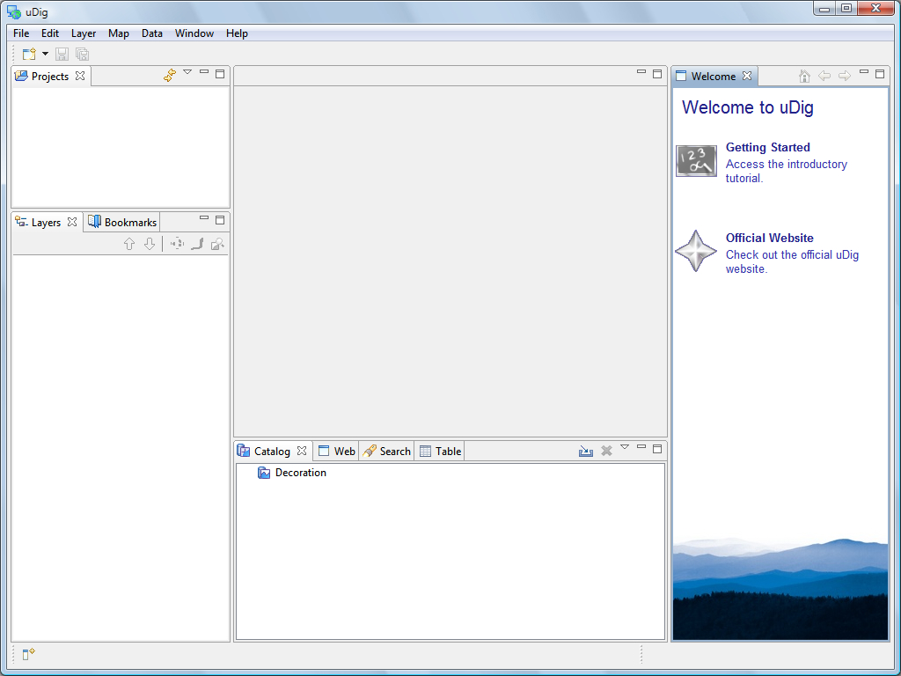
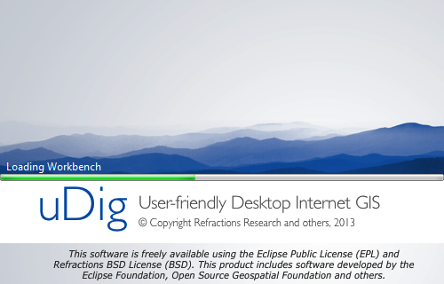

Welcome
-----------------------------------

Now that everything is installed we can start up the application for the first time.

1. After completing the installation, run the uDig application from the Windows
   :guilabel:`Start->Programs` menu.
   
   |splash_png|

2. Initially you are presented with the uDig workbench. The uDig workbench consists of a number of panels called
   views.
   
   |welcome_png|

3. The :guilabel:`Welcome` view runs along the right hand side of the screen. This view contains:

   * a link to the :guilabel:`Getting Started` tutorial from the online documentation.
     We cover the use of the online documentation in the next section

   * a link to the uDig :guilabel:`Website`

      
4. To close the :guilabel:`Welcome` view click the :guilabel:`x` next to the word welcome.

5. You can return to the welcome screen at any time using the :guilabel:`Help > Welcome` menu item.

