What to do Next
---------------

Congratulations you have finished the first Walkthrough 1.

This is just the start of what uDig can do!

* Try out the :doc:`North Arrow` decorator and change projections in order to see how it works.

  |north_arrow_png|

* There is more great data available in the data directory - have a look !
  
  This information has been collected by the `natural Earth <http:naturalearth.org>`_ project. Their website
  contains more detailed downloads and a host of additional data.
  
  Try downloading the same data at several scales and compare the results.

* Try right-clicking on a Layer - there is plenty to do (especially in the :guilabel:`Operations` menu).

* Try making use of spatial information from your organisation or government.

* Try out the navigation tools such as :guilabel:`Zoom` and :guilabel:`Pan`.
  The :guilabel:`Navigation` menu lets you you retrace your steps.
  
  Changing coordinate reference system is also considered a navigation command.

* Advanced: Use the :guilabel:`Style Editor` to switch automatically from
  a raster layer to a web service.
  
  Switching based on scale allows for performance when zoomed out, while still
  providing full resolution when zoomed in.

* Advanced: Open the :guilabel:`Style Editor` and have a look at the
  :guilabel:`Advanced (XML)` page and see what you make of it.

* Perhaps you have an idea for the tool you always wanted?
  
  Developer tutorials including how to make a custom tool and create a custom
  application are available on the project web site.

Install Plugin
^^^^^^^^^^^^^^

One of the nice things about uDig is the ease to download and install additional plug-ins provided by the developer community.

1. Open up :guilabel:`Help > Find and Install`
   
   |menubar_help_install_png|

2. Select :guilabel:`Search for New Features to Install` and press :guilabel:`Next`.
   
   |update_site_search_png|

3. Press the :guilabel:`New Remote Site` button and type the following parameters:
   
   * Name: :kbd:`uDig Community Updates`
   * URL: :kbd:`http://udig.refractions.net/update/1.2/community`
   
   |update_site_png|

4. Check the new :guilabel:`uDig Community Updates` option and press :guilabel:`Finish`
   
   |update_site_install_png|

5. Please wait while the program checks the update site for new features.
   
   |update_stie_checking_png|

6. Once the program finishes getting the complete list of plug-ins, you will see something like this:
   
   |update_site_search_results_png|

7. Check the latest *es.axios.udig.editingtools* version from the list and press :guilabel:`Next`.

8. Accept the terms in the license agreement and press :guilabel:`Next`.
  
   |update_site_license_png|

8. Finally confirm the installation location and press :guilabel:`Finish`.
   
   |update_site_installation_png|

9. Many of the community features have not been formally signed, please click :guilabel:`Install All` 
   when presented with a warning.
   
   |update_site_verification_png|

10. You will need to :guilabel:`Restart` when the installation finishes.

    |update_site_restart_png|

11. You may have noticed some new options in the toolbar, such as the merge tool described in the next section. 

Merge
^^^^^

1. We are going to test the :guilabel:`Merge` feature.
    
2. Load a test layer, like :guilabel:`countries` and select the
   :guilabel:`Merge` tool,
    
   |merge_tool_palette_png|

3. Select some features in your layer.
   
   |merge_png|
   
   |merge_select_png|

4. A new View called :guilabel:`Merge Tool` will appear in the lower box.
   
   |merge_view_png|

5. Click on the green check :guilabel:`Apply` button  in the :guilabel:`Merge` view toolbar
   to run the merge of the features.
   
6. The result will be something like this:
   
   |merge_result_png|

Adding a Layer from PostGIS
^^^^^^^^^^^^^^^^^^^^^^^^^^^

.. sidebar:: Firewall
   
   This section requires your own local PostGIS. While we have a public PostGIS available
   for demonstrations most corporate environments are unable to access this database due
   to firewall restrictions.
   
   If you are trapped behind a firewall please feel free to skip this section.
   
   The online help does have some advice about :doc:`Running uDig` covering
   firewall access.
   
This section shows how you can add a Layer from a PostGIS table. PostGIS is an extension to the popular
open source PostgreSQL database. uDig handles other databases like Oracle and DB2 in a similar manner:

1. In the File menu, select :guilabel:`New > New Map`.
   
   |menubar_new_map_png|

2. In the :guilabel:`Projects` view, right-click on your map and select :guilabel:`Add`.
   
   |projects_map_add_png|

3. Select :guilabel:`PostGIS` as the data source and click :guilabel:`Next`.
   
   |postgis_wizard_png|

4. Enter the following connection information:
   
  * Host: :kbd:`www.refractions.net`
  * Port: :kbd:`5432`
  * Username: kbd:`demo`
  * Password: :kbd:`demo`
  * Store Password: check
  
  Once the connection information is entered press :guilabel:`Next`.
  
  |postgis_connect_png|

5. This page lists the databases available to the current user.
   
   The www.refractions.net database does not publish a public list so rather than choose from a
   nice easy list we are going to have to enter in :kbd:`demo-bc` by hand.
   
   * Database: :kbd:`demo-bc`
   
   |postgis_list_png|

7. We can now press the :guilabel:`List` button to list the available tables. Please choose
   
   *:guilabel:`bc_hospitals`
   *:guilabel:`bc_municipality`
   
   Press :guilabel:`Next` when ready.

8. The resource collection page confirms that :guilabel:`bc_hospitals` and :guilabel:`bc_municipality`
   are published as spatial layers.
   
   We can press :guilabel:`Finish` to add these layers to our Map.
   
   |postgis_resource_selection_png|

9. It may take a short while to fully render since you are zoomed out so far.
   
10. Head on over the the :guilabel:`Layer` view and right click on
    :guilabel:`bc_hospitals` layer and choose :guilabel:`Zoom to Layer`
    
    |postgis_zoom_to_layer_png|
    
    The map will now zoom in to show the extent of the :guilabel:`bc_hospitals` layer.

11. You can return to your previous position in the world by selecting Back in the Navigation menu.

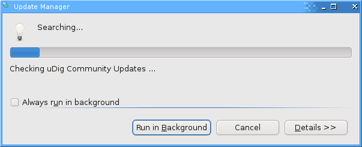

.. |update_site_install_png| image:: images/update_site_install.png
    :width: 8.53cm
    :height: 9.197cm

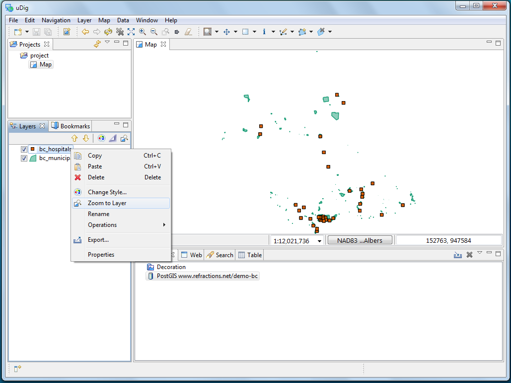

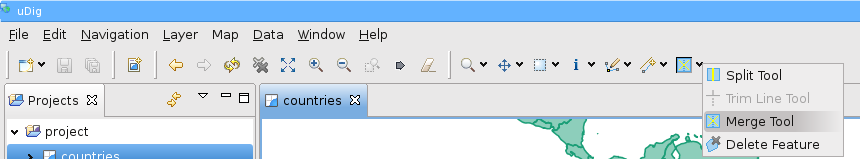

.. |north_arrow_png| image:: images/north_arrow.png
    :width: 11.479cm
    :height: 7.31cm

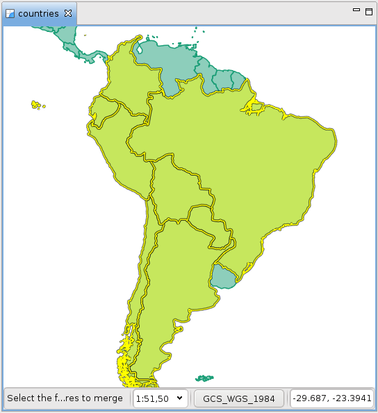

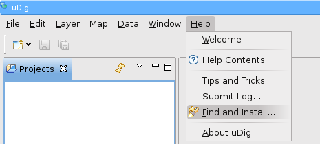

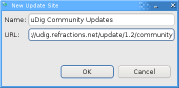

.. |postgis_wizard_png| image:: images/postgis_wizard.png
    :width: 8.89cm
    :height: 7.26cm

.. |postgis_list_png| image:: images/postgis_list.png
    :width: 9.631cm
    :height: 8.729cm

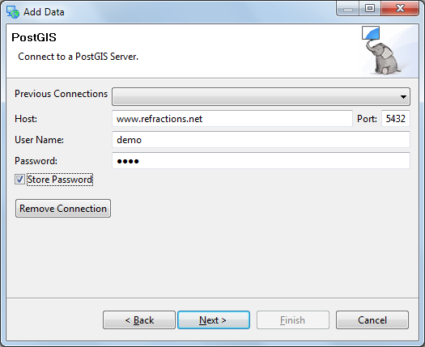

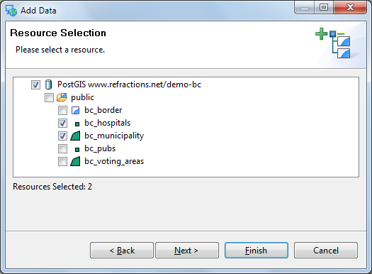

.. |projects_map_add_png| image:: images/projects_map_add.png
    :width: 4.979cm
    :height: 4.641cm

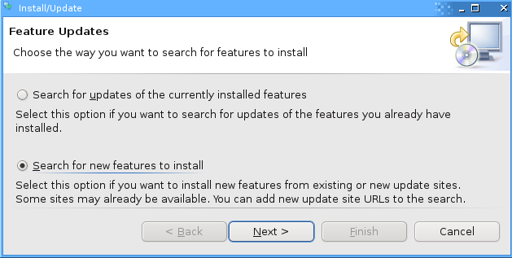

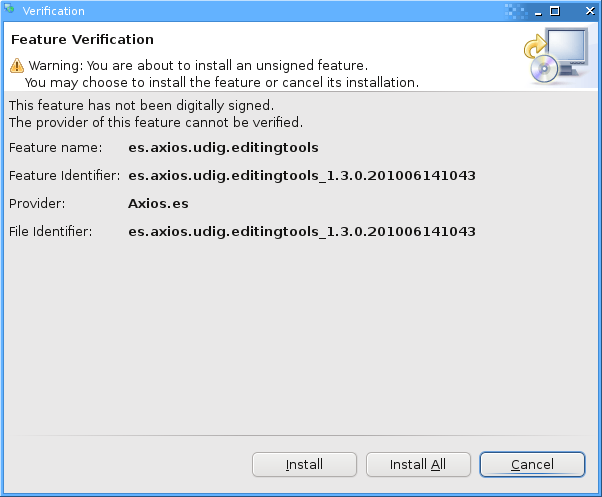

.. |update_site_search_results_png| image:: images/update_site_search_results.png
    :width: 10.116cm
    :height: 9.594cm

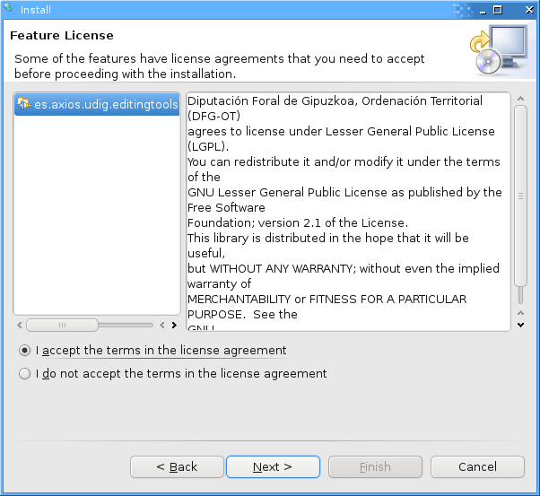

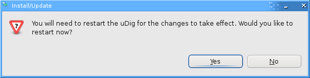

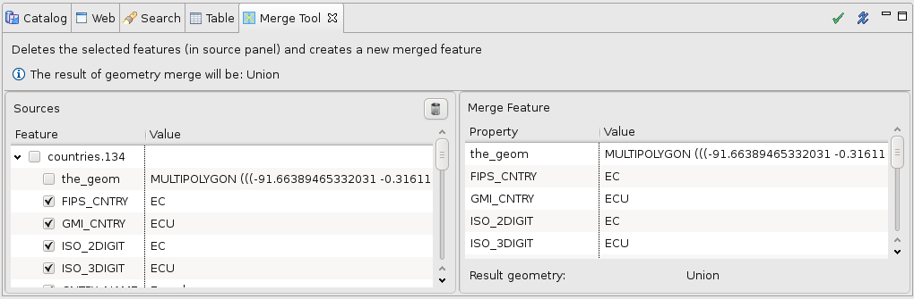

.. |merge_result_png| image:: images/merge_result.png
    :width: 9.629cm
    :height: 10.643cm

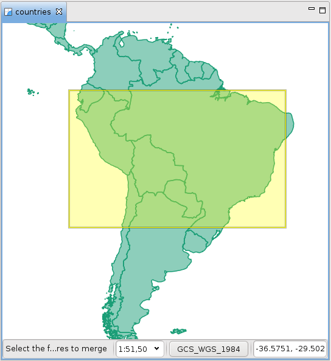

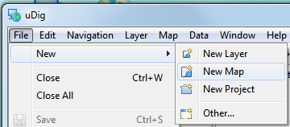

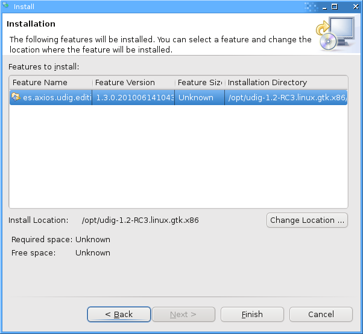

