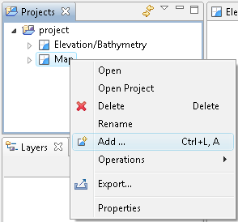
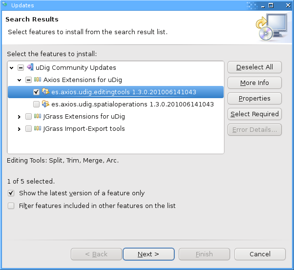
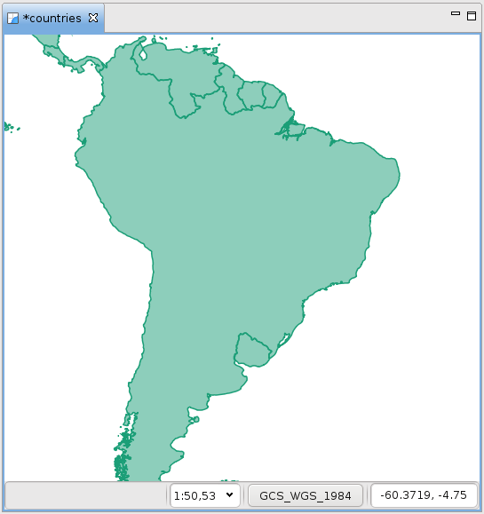

What to do Next?
-----------------------------------

Congratulations you have finished the first walkthrough. This is just the start of what uDig can do!

* Try out the north arrow – change projections in order to see how it works.
  |100000000000026C0000018BE3CEFED9_png|

* There is more data available in the data directory - have a look !

* Try right-clicking on a Layer – there is plenty to do (try the operations menu).

* Does your organization publish any spatial information on the web?

* Try out the navigation tools such as Zoom and Pan (the Navigation menu lets you go back to previous locations like a web browser).

* Advanced: Use the
  Style Editor
  to switch automatically from the bluemarble.tiff to the JPL Web Map Server blue marble layer. Switching based on scale allows for performance when zoomed out, while still providing full resolution blue marble imagery from NASA when you are closer.

* Advanced: Open the
  Style Editor
  , have a look at the
  Advanced
  (
  XML
  ) page and see what you make of it.

Perhaps you have an idea for the tool you always wanted?

Community
---------

One of the nice things about uDig is the ease to download and install additional plug-ins provided by the developer community.

* Open up
  Help
  >
  Find and Install
  |10000000000001D1000000D27D89B6DA_png|

* Select
  Search for New Features to Install
  and press
  Next
  |10000000000002750000013D3A5ED79C_png|

* Press the
  New Remote Site
  button and type the following parameters:
  Name:
  uDig Community Updates
  URL:

  |1000020100000166000000B09D072A10_png|

* Check the new
  uDig Community Updates
  option and press
  Finish
  |10000201000002770000029DF0ED262D_png|

* Please wait while the program checks the update site for new features.
  |100002010000025B000000F5B04A0404_png|

* Once the program finishes getting the complete list of plug-ins, you will see something like this:
  |100002010000025A00000229706BBF67_png|

* Check the latest
  *es.axios.udig.editingtools*
  version from the list and press
  Next
  .

* Accept the terms in the license agreement and press
  Next
  .
  |100002010000025A000002294F137721_png|

* Finally confirm the installation location and press
  Finish
  .
  |100002010000025A000002292818B80D_png|

* Many of the community features have not been formally signed, please click
  Install All
  when presented with a warning.
  |100002010000025A000001F11BE2F1C2_png|

* You will need to
  Restart
  uDig when the installation finishes.
  |100002010000025B00000098C874C9A5_png|

* You may have noticed some new options in the toolbar. We are going to test the
  Merge
  feature.

* Load a test layer, like
  *countries*
  , and select the
  Merge
  option as shown below.
  |100000000000035C0000009FF4CBA78B_png|

* Select some features in your layer.
  |10000000000002200000025226C9A962_png|
  |1000000000000220000002533D172BB1_png|

* A new View called
  Merge Tool
  will appear in the lower box.
  |10000000000003FC0000014FB2C974F4_png|

* Click on the
  green check
  on the upper-right corner of the
  Merge Tool
  view to run the merge of the features. The result will be something like this:
  |10000000000002210000024330223155_png|

Adding a Layer from PostGIS
---------------------------

This section shows how you can add a Layer from a PostGIS table. PostGIS is an extension to the popular open source PostgreSQL database. uDig handles other databases like Oracle and DB2 in a similar manner:

* In the File menu, select
  New -> New Map
  .
  |10000000000001680000009E5CAF954B_png|

* In the
  Projects
  view, right-click on
  Map
  and select
  Add
  .
  |10000000000001260000011268DE12AC_png|

* Select
  PostGIS
  as the data source and click
  Next
  .
  |100000000000020D000001AD21F4CAF3_png|

* Enter the following connection information:

  Host:
  Port:
  5432
  Username:
  demo
  Password:
  demo

  Store Password:
  check
  |100000000000020D000001ADB9E75C01_png|
  Once the connection information is entered press
  Next
  .

* This page lists the databases available to the current user. The
  does not publish a public list – so rather then choose from a nice easy list we are going to have to enter in “demo-bc” by hand.
  Database:
  demo-bc
  |100000000000020D000001DC5AC9B824_png|

* We can now press the List button to list the available tables. Please choose
  bc_hospitals
  and
  bc_municipality
  and press
  Next
  .

* The resource collection page confirms that
  bc_hospitals
  and
  bc_municipality
  are published as spacial layers. We can press
  Finish
  to add these layers to our Map.
  |100000000000020D0000018256DA3A32_png|

* It may take a short while to fully render since you are zoomed out so far.

* Head on over the the
  Layer
  view and right click on
  bc_hospitals
  layer in order to choose
  Zoom to Layer
  |1000000000000405000003056AEA1FCC_png|
  The map will now zoom in to show the extent of the bc_hospitals layer.

* You can return to your previous position in the world by selecting Back in the Navigation menu.

.. |100002010000025B000000F5B04A0404_png| image:: images/100002010000025B000000F5B04A0404.png
    :width: 10.361cm
    :height: 4.018cm

.. |10000201000002770000029DF0ED262D_png| image:: images/10000201000002770000029DF0ED262D.png
    :width: 8.53cm
    :height: 9.197cm

.. |1000000000000405000003056AEA1FCC_png| image:: images/1000000000000405000003056AEA1FCC.png
    :width: 14.52cm
    :height: 10.91cm

.. |100000000000035C0000009FF4CBA78B_png| image:: images/100000000000035C0000009FF4CBA78B.png
    :width: 12.577cm
    :height: 2.508cm

.. |100000000000026C0000018BE3CEFED9_png| image:: images/100000000000026C0000018BE3CEFED9.png
    :width: 11.479cm
    :height: 7.31cm

.. |1000000000000220000002533D172BB1_png| image:: images/1000000000000220000002533D172BB1.png
    :width: 5.916cm
    :height: 7.121cm

.. |10000000000001D1000000D27D89B6DA_png| image:: images/10000000000001D1000000D27D89B6DA.png
    :width: 8.61cm
    :height: 3.889cm

.. |1000020100000166000000B09D072A10_png| image:: images/1000020100000166000000B09D072A10.png
    :width: 6.618cm
    :height: 3.226cm

.. |100000000000020D000001AD21F4CAF3_png| image:: images/100000000000020D000001AD21F4CAF3.png
    :width: 8.89cm
    :height: 7.26cm

.. |100000000000020D000001DC5AC9B824_png| image:: images/100000000000020D000001DC5AC9B824.png
    :width: 9.631cm
    :height: 8.729cm

.. |100000000000020D000001ADB9E75C01_png| image:: images/100000000000020D000001ADB9E75C01.png
    :width: 9.631cm
    :height: 7.87cm

.. |100000000000020D0000018256DA3A32_png| image:: images/100000000000020D0000018256DA3A32.png
    :width: 9.631cm
    :height: 7.08cm

.. |10000000000002750000013D3A5ED79C_png| image:: images/10000000000002750000013D3A5ED79C.png
    :width: 13.31cm
    :height: 6.71cm

.. |100002010000025A000001F11BE2F1C2_png| image:: images/100002010000025A000001F11BE2F1C2.png
    :width: 9.627cm
    :height: 8.225cm

.. |100002010000025A000002294F137721_png| image:: images/100002010000025A000002294F137721.png
    :width: 10.343cm
    :height: 10.045cm

.. |100002010000025B00000098C874C9A5_png| image:: images/100002010000025B00000098C874C9A5.png
    :width: 11.374cm
    :height: 2.822cm

.. |10000000000003FC0000014FB2C974F4_png| image:: images/10000000000003FC0000014FB2C974F4.png
    :width: 13.173cm
    :height: 4.313cm

.. |10000000000002200000025226C9A962_png| image:: images/10000000000002200000025226C9A962.png
    :width: 5.916cm
    :height: 7.121cm

.. |10000000000001680000009E5CAF954B_png| image:: images/10000000000001680000009E5CAF954B.png
    :width: 6.669cm
    :height: 2.93cm

.. |100002010000025A000002292818B80D_png| image:: images/100002010000025A000002292818B80D.png
    :width: 9.516cm
    :height: 9.243cm

