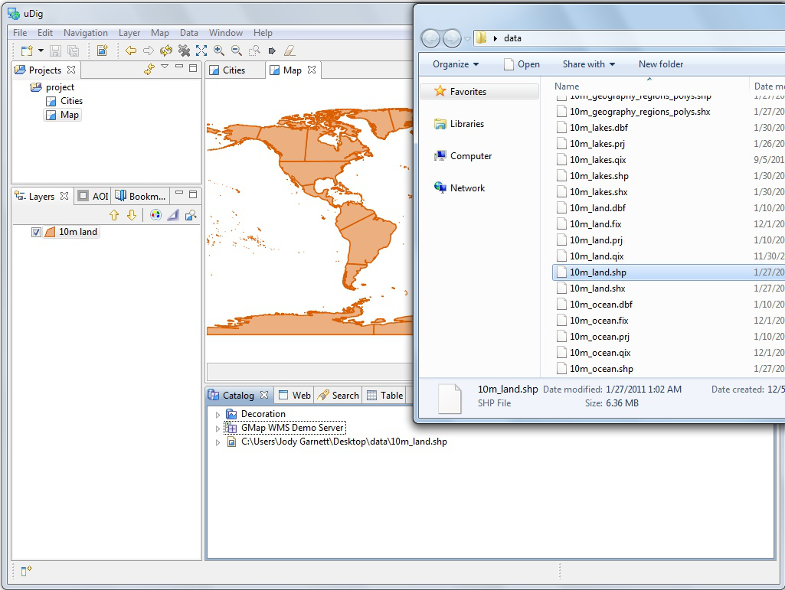

Working with Files
-----------------------------------

You can work directly with files from the file system:

* Please connect to the Walkthrough 1 page with your web browser:

* 

* Click on the data “data download” link and save the zip file to your local computer.
  At the time of writing the file was:

* 

* Unzip the download to create your
  data
  directory. The
  7-Zip
  application is recommended.

* Create an empty Map by slecting
  File > New > New Map
  from the menubar.

* Drag and Drop the file
  10m_land.shp
  onto your open
  Map
  |100000000000040100000303FBBE0454_png|

* The map will take the size of the first file added to it; you can also see the file listed in the catalog in case you wish to use it on another map.

* When working with uDig you will often find yourself combining information from several different sources. Try adding the
  10m_ocean.shp
  shapfile to your map
  |100000000000040100000303F53E8033_png|

.. |100000000000040100000303F53E8033_png| image:: images/100000000000040100000303F53E8033.png
    :width: 14.91cm
    :height: 11.269cm

