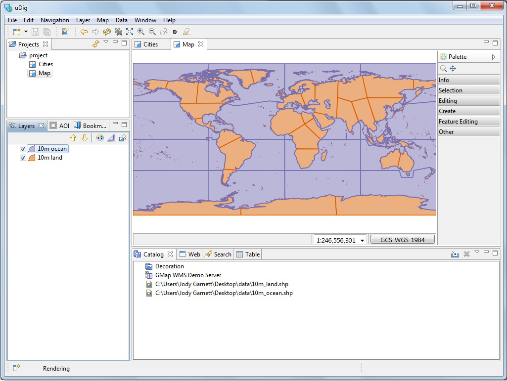

Working with Files
-----------------------------------

.. sidebar:: Workshop
   
   You instructor has placed the data directory on your dvd.
   Please copy this folder to your machine prior to use.

You can work directly with files from the file system.

1. This section makes use of sample data provided by the *Natural Earth* project.

2. Click on the following link and save the zip file to your local computer.
   
   * `data_1_3.zip <http://udig.refractions.net/files/data/data_1_3.zip>`_ 
   
   This link is also avaialble from the
   `Walkthrough 1 <http://udig.refractions.net/confluence/display/EN/Walkthrough+1>`_ page.

3. Unzip the download to create your *data* directory.
   
   * You may wish to create a data directory on your desktop or in your documents folder.
   * On windows the `7-Zip <http://www.7-zip.org/>`_ application is recommended for unzipping files

4. Create an empty Map by selecting :guilabel:`File > New > New Map`
   from the :guilabel:`menubar`.

5. Drag and Drop the file :guilabel:`10m_land.shp` onto your open :guilabel:`Map`
   
   |file_dnd_png|

  The map will take the size of the first layer added to it.

  You can also see the file listed in the :guilabel:`Catalog` view in case you wish to use it on another map.

6. When working with uDig you will often find yourself combining information from several
   different sources.
   
   Add the :guilabel:`10m_ocean.shp` shapefile to your map.
   
   |file_add_png|
   
   The application will automatically:
   
   * Make use of any included style layer descriptor file, or generate a default style.
   
   * Perform any reprojection required on the fly allowing you to view layers side by side
   

.. |file_dnd_png| image:: images/file_dnd.png
    :width: 14.88cm
    :height: 11.19cm

