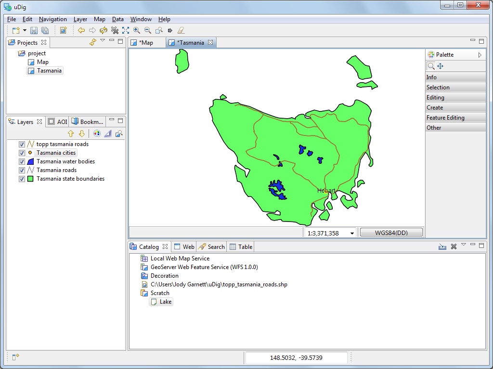

Copying Content
===============

Now that we have created a new feature type, we can use cut and paste to grab geometry content from our WFS. This is different from the export we did earlier in that we are using our layer type.

* Change to
  Tasmania
  map and select
  Navigation->Zoom AOI
  in the menu bar.

* In the Layers view make sure that
  tasmania_water_bodies_Type
  is selected as shown below.
  |10000000000004000000030023770A95_png|

* Select
  Box Selection
  from the tool palette.

* Use the Box Selection tool to draw a box around all the lakes. The lakes will change color when selected.
  |10000000000002EF000001AA95D08BED_png|

* Select
  Edit->Copy
  from Edit menu. These lakes will be placed onto the clipboard.
  |10000000000002EE000001AB9BBA0176_png|

* Switch over to the
  New Tasmania
  map. Ensure your
  select
  Lake
  layer is selected in the layer view, and r
  ight-click
  mouse
  button to select
  Paste
  .
  |1000000000000400000003000F6CA017_png|

* Press
  commit
  to write these new features into your Scratch layer.

