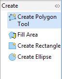
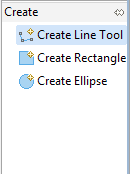

Create Geometry
===============

The second category of tools involves creating geometry, we will cover line and polygon creation and “vertex snapping”.

* Select
  tasmanian roads
  in the layer view.
  |2000000700001A4100000AC1605832B4_svm|

* Choose the
  Create Line Tool
  from the
  Create
  drawer of the
  Palette
  .
  |1000000000000082000000AEF6546448_png|

* Draw
  a road on the n
  orthern

  part of the island, once again
  Enter
  to indicate that you are finished your line.
  |2000000700004DBA00002C58C786D350_svm|

* You have just created a new road, remember to press
  commit
  in the tool bar to write your change to the shape file.

* Change to the
  Lake
  layer in the layer view.
  |2000000700001A27000009ED80B15389_svm|

* Select the
  Create Polygon
  Tool.
  |1000000000000080000000A412A01279_png|

* Enable snapping by pressing
  CTRL+SHIFT+S
  until
  Snap to features in current layer
  is displayed in a dialog.
  |2000000700004DBA00002C72685ABCDD_svm|

* Draw a polygon, close to a feature, as you draw close to another polygon you can watch how snapping effects the drawing process.
  |2000000700004D9F00002C23AD78ED6A_svm|

* You can complete your polygon by ending it on the vertex that started the polygon.

* Please press the
  commit button
  in the toolbar.

.. |2000000700001A27000009ED80B15389_svm| image:: images/2000000700001A27000009ED80B15389.svm
    :width: 4.69cm
    :height: 1.78cm

.. |2000000700004D9F00002C23AD78ED6A_svm| image:: images/2000000700004D9F00002C23AD78ED6A.svm
    :width: 13.869cm
    :height: 7.909cm

.. |2000000700004DBA00002C72685ABCDD_svm| image:: images/2000000700004DBA00002C72685ABCDD.svm
    :width: 13.91cm
    :height: 7.96cm

.. |2000000700001A4100000AC1605832B4_svm| image:: images/2000000700001A4100000AC1605832B4.svm
    :width: 4.701cm
    :height: 1.93cm

.. |2000000700004DBA00002C58C786D350_svm| image:: images/2000000700004DBA00002C58C786D350.svm
    :width: 13.91cm
    :height: 7.95cm

