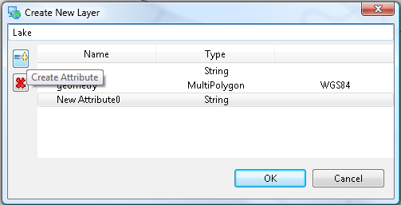
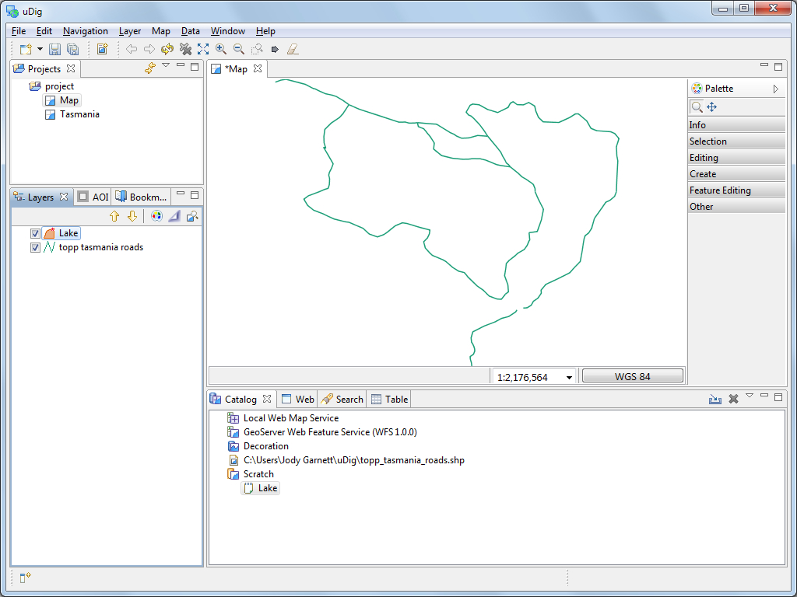
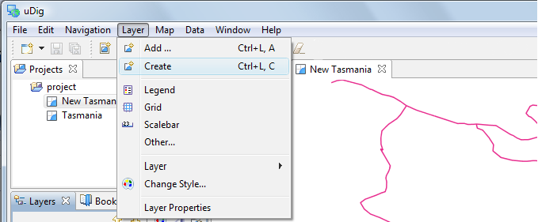
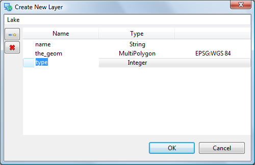
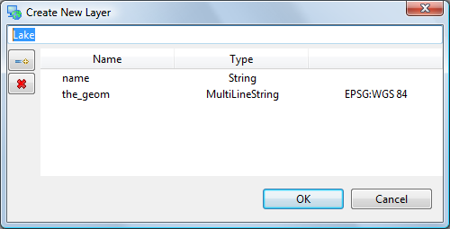

Creating Feature Type
=====================

We are going to create a new feature type to experiment with some of the more interesting edit tools.

* Create a
  New Map

* Rename the map to “
  New Tasmania”
  |2000000700001A5C000011440D3C9B09_svm|

* Add the
  “
  tasmanian roads.shp
  ” file you created previously. You can drag and drop the file onto the map, or use
  Layer > Add
  from the menu bar.

* Select the
  Layer -> Create
  command from the menu bar.
  |10000201000002A700000119FDD8B78F_png|

* Replace “New Feature Type” with “
  Lake
  ”.
  |10000000000001F4000000FF67B28346_png|

* Change the type of the “the_geom” attribute
  to

  Multi
  Polygon
  .
  |20000007000033E300001A91A7F5F4E6_svm|

* Click
  Add
  Attribute
  button.
  |10000000000001F7000001017AF942CD_png|

* Select your new attribute and change the Type to “
  Integer
  ” and the Name to “
  type
  ”
  |10000000000001F40000014470BD8906_png|

* Press
  OK
  button

* Your layer has been added to the current map

* Your data has been added to the
  Scratch
  area of the catalog
  |1000000000000400000003009C985683_png|

.. |2000000700001A5C000011440D3C9B09_svm| image:: images/2000000700001A5C000011440D3C9B09.svm
    :width: 4.05cm
    :height: 2.649cm

.. |20000007000033E300001A91A7F5F4E6_svm| image:: images/20000007000033E300001A91A7F5F4E6.svm
    :width: 7.969cm
    :height: 4.08cm

