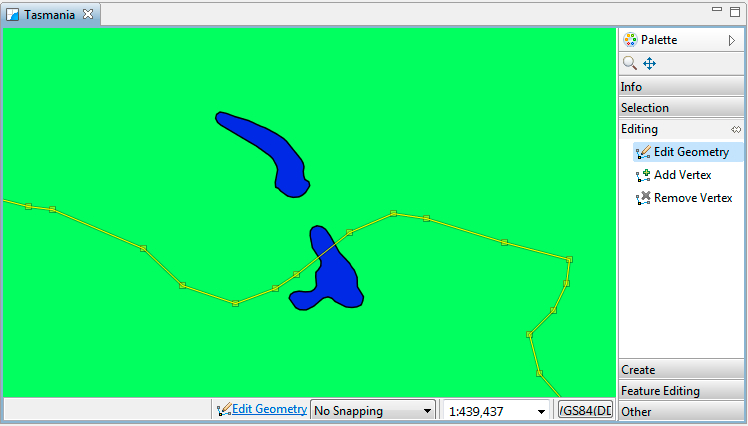
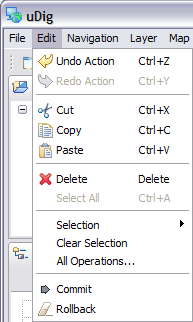
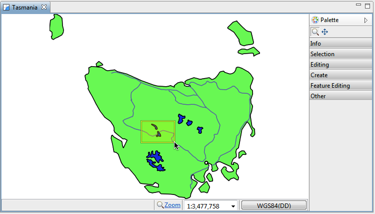
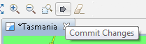
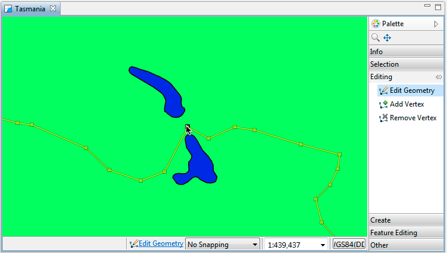
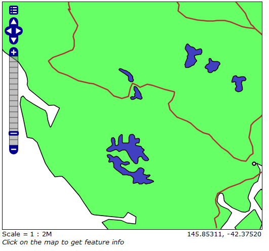

Editing Geometry with WFS
=========================

We will use the Edit Geometry tool to move the road around the lake.

* Zoom into the road that is crossing the lake in the center of the country
  |10000000000002EE000001AB5759BA81_png|

* Select
  tasmania_roads_Type
  in the
  Layers
  view.
  |10000000000000FE00000087DC5D42AA_png|

* Change to the
  Edit Geometry
  tool from the tool palette
  (click the
  Editing
  drawer to see the available editing tools).

* Use the
  Edit Geometry
  tool to select the road crossing the lake.
  |10000000000002EC000001AA32F1BEEA_png|

* The road will change color and develop “vertex handles”.

* Move the vertex handles so the road does not enter the water.
  |10000000000002EF000001A97F242FDB_png|

* Add new vertices by switching to the
  Add Vertex
  tool.

* You can click any where on the road to add a new vertex.
  |10000000000002EF000001AA50861B63_png|

* You can use
  Undo
  and
  Redo
  in the Edit menu as required.
  |10000000000000C1000001426E66DB64_png|

* Press the
  Commit Changes
  button in the tool bar to send your changes off to the Web Feature Server.
  |10000201000000D10000004025531F72_png|

* Your line has now been moved.

* You can now refresh your web page to confirm that your changes have been made.
  |1000000000000213000001F04B82ED88_png|

* You can edit many Features at once, from different layers, or from different sources of data. Pressing
  Commit Changes
  will send off all the changes made in the current map.

.. |10000000000000FE00000087DC5D42AA_png| image:: images/10000000000000FE00000087DC5D42AA.png
    :width: 3.679cm
    :height: 1.96cm

