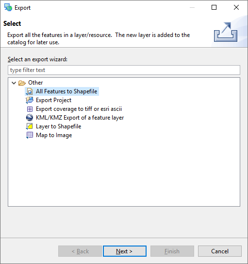

Exporting to Shape file
=======================

In addition to editing content from many sources, you can also export content to a shapefile.

* With
  Tasmania roads
  selected, choose
  File > Export
  from the menu bar

* Select the
  Resource to Shapefile
  and press
  Next
  |100000000000020D000002265A8298F4_png|

* Your
  Tasmania roads
  layer will be available for export, you can see that it is in the “WGS84” projection.
  |100000000000020D0000019B7CFD50AE_png|

* Press
  Finish
  to save the file to disk.
  |2000000700004DBA00000B5F6FBF7325_svm|

.. |2000000700004DBA00000B5F6FBF7325_svm| image:: images/2000000700004DBA00000B5F6FBF7325.svm
    :width: 13.869cm
    :height: 2.041cm

