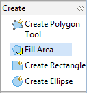

Fill Tool
=========

The Fill tool fills spaces that are
not
occupied by existing features.

* Select the Fill Area Tool.
  |100000000000007F0000008732765E55_png|

* Draw
  a Polygon that goes through some existing features.
  |2000000700004DBA00002C587772B48E_svm|

* Change to the select tool and click on the Polygon to select it. This is in-fact a multi polygon; a single feature made up of separate shapes on the map.
  |2000000700004DBA00002C3D7A241526_svm|

.. |2000000700004DBA00002C3D7A241526_svm| image:: images/2000000700004DBA00002C3D7A241526.svm
    :width: 13.929cm
    :height: 7.93cm

.. |2000000700004DBA00002C587772B48E_svm| image:: images/2000000700004DBA00002C587772B48E.svm
    :width: 13.929cm
    :height: 7.96cm

