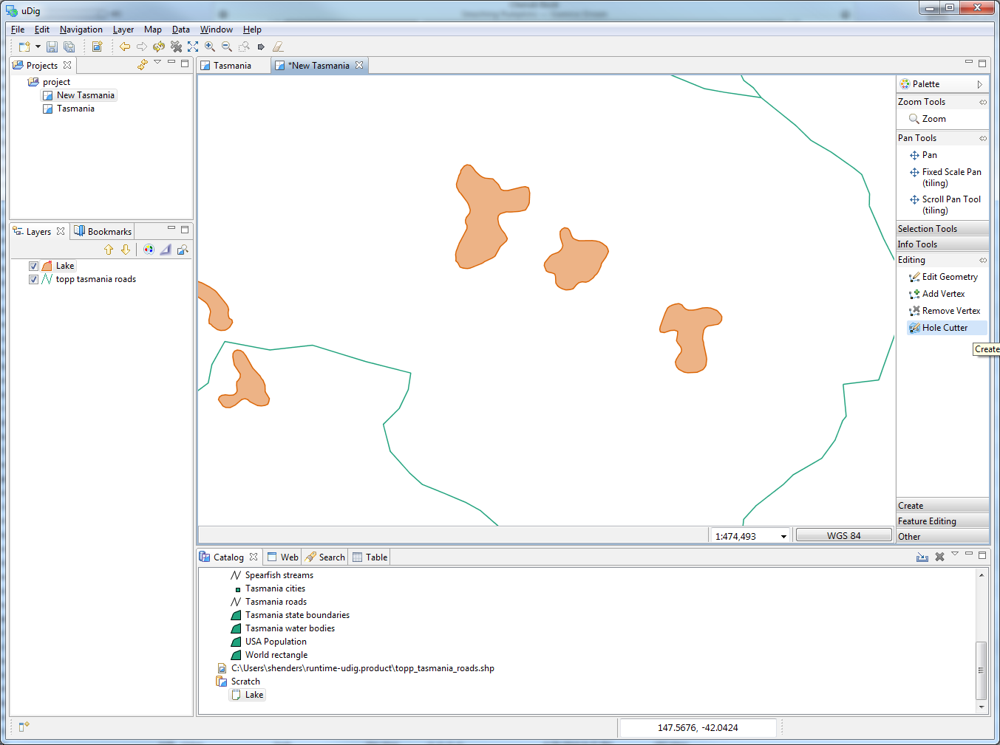

Hole Cutter
===========

In this section we will cover how to create a hole in a polygon.

* Open the
  New Tasmania
  map and zoom to lake shown below.
  |2000000700004D8500002C72ABCBBEB5_svm|

* Open the
  Editing
  drawer of the
  Palette
  to show
  all the edit geometry tools. Select the
  Hole Cutter
  tool from the tool palette.
  |1000000000000549000003F10111D915_png|

* Use the hole cutter to draw a polygon
  within
  the lake.
  |2000000700004D9F00002C58DB88B3E0_svm|

* Press
  Enter,
  or click on the first vertex, to create the island.

* Press the
  Commit
  button in the toolbar.

.. |2000000700004D9F00002C58DB88B3E0_svm| image:: images/2000000700004D9F00002C58DB88B3E0.svm
    :width: 13.869cm
    :height: 7.95cm

.. |2000000700004D8500002C72ABCBBEB5_svm| image:: images/2000000700004D8500002C72ABCBBEB5.svm
    :width: 13.951cm
    :height: 8.98cm

